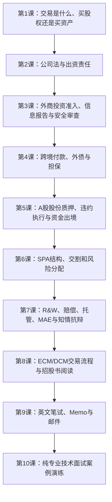
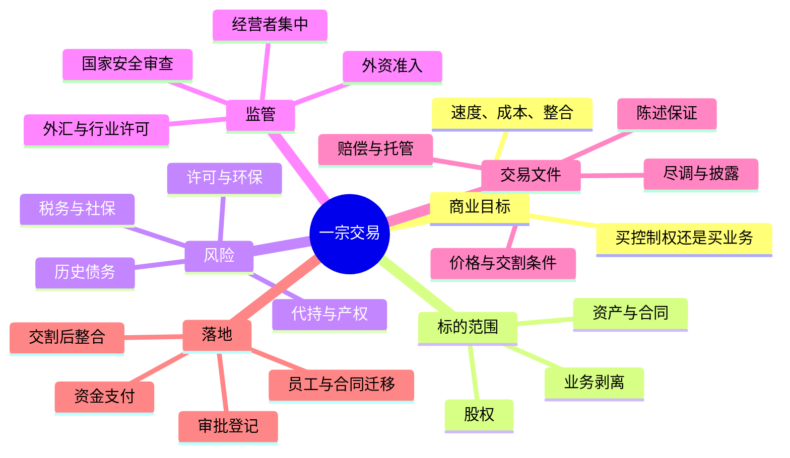

# 外资律所并购与资本市场入门学习手册

> **版本与范围**：第一阶段学习材料；截至 2026 年 9 月 28 日整理。重点是中国法下的非诉 M&A、PE/FDI、跨境融资与资本市场交易，以及相关英文笔试和技术面试。本文不是个案法律意见。法规、负面清单、交易所规则和外汇操作口径可能更新，实际使用时应核对现行官方文本和主管机关/经办银行要求。
>
> **当前内容**：总学习地图 + 第一课（并购结构）+ 第二课（新《公司法》出资责任）+ 第三课（外资准入与并购监管）+ 第四课（跨境借款、外债与担保）+ 第五课（A 股股票质押）。SPA 起草和英文面试已列入课程地图，后续逐课展开。

## 怎么使用这本手册

先学“交易要解决什么问题”，再学法规怎样限制方案，最后练习把结论写成客户能执行的建议。不要从背条号开始。遇到任何交易题，先回答四个问题：

1. **买什么**：股权、资产，还是某一项业务/少数股权？
2. **谁承担什么风险**：历史负债、员工、许可、税务、环境和关联方风险落在哪里？
3. **交易能否落地**：审批/备案、登记、第三方同意、融资和交割条件是什么？
4. **如果风险发生，谁付钱、从哪里拿到钱**：赔偿承诺、托管款、价格调整、保险或退出机制是否够用？

每一课建议按“读懂概念 → 自己画图 → 用清单分析 → 用英文口述”的顺序学习。初学阶段，每天 45–60 分钟即可：20 分钟读规则，15 分钟做一页结构图，10 分钟复述，最后 5 分钟记下仍不明白的点。

## 全课程路线图

| 课次 | 学完后应能做到 | 核心内容 | 主要输出 |
|---|---|---|---|
| 1 | 用商业和法律语言解释股权/资产交易取舍 | 负债、许可、员工、税费、合同转移 | 一页交易结构比较表 |
| 2 | 识别出资期限和股东责任如何影响估值与交割 | 2023《公司法》、五年缴资、催缴/失权、加速到期、股权转让责任、减资 | 出资责任图、SPA 条款清单 |
| 3 | 判断外资能否进入、是否要申报/审查 | 《外商投资法》、负面清单、信息报告、安全审查、历史三资企业治理 | 准入与审批路径图 |
| 4 | 判断境内外借款/担保需要的外汇路径 | 29号文、19号文、9号文、外债登记、资金用途 | 资金流与担保流示意图 |
| 5 | 说明境内上市股份质押从设立到执行的路径 | 《民法典》第443条、CSDC登记、证券规则、拍卖及购汇汇出 | 违约执行流程图 |
| 6 | 看懂 SPA 从签署到交割的结构 | CP、交割、先决条件、过渡期、终止权、披露函 | SPA 目录和时间轴 |
| 7 | 设计可谈判的风险分配条款 | R&W、专项赔偿、托管、MAE、sandbagging | 中英文条款片段 |
| 8 | 讲出 IPO/债券发行的主要工作流 | ECM、DCM、尽调、披露、承销、上市/发行条件 | 资本市场流程图 |
| 9 | 在限时题中给出可执行的英文意见 | BLUF、IRAC/CREAC、事实取舍、英文校对 | 2小时答题模板 |
| 10 | 对复杂交易情境作出有依据的英文口头答复 | 公司法/外汇/FDI/NSR/JV | 五道模拟案例答题卡 |

### 先记住的六个“交易镜头”

