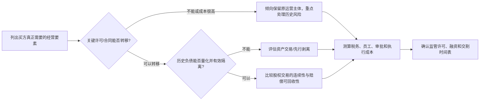

## 第一课：先看懂交易，再选择结构

### 1. 并购到底买的是什么？

把一家公司想成一个装着多种东西的“盒子”：盒子里有资产、合同、员工、许可证、债务、税务记录、知识产权和经营历史。

- **股权收购（share acquisition / equity deal）**：买盒子的所有权。目标公司通常仍是原来的法人，只是股东变了。公司拥有的资产、合同和债务仍在公司名下；买方通过持股取得股东权利，并可能取得控制权。
- **资产收购（asset acquisition / asset deal）**：买盒子里列明的一部分东西，例如设备、存货、商标、客户合同或某条生产线。买方或新设公司成为所买资产的权利人；每项资产和合同通常要按其自己的转让规则处理。
- **业务剥离（carve-out）**：先把要出售的业务从卖方集团或目标公司中分离，再出售股权或资产。它是交易准备和范围设计，不是独立的法定交易类型。

**重要区别**：股权收购中，买方不是直接成为目标公司每项资产的所有人，而是成为目标公司的股东。目标公司仍是资产和债务的权利义务主体。买方会承受这些历史风险的经济影响，但合同赔偿、交割前提和交易结构仍可分配风险。

### 2. 一个小例子

美国买方想收购中国一家制造企业。尽调发现：核心生产许可在目标公司名下；公司有未缴税款和社保；部分设备属于卖方关联公司；核心技术是从美国母公司许可取得；银行流水存在无法解释的关联方付款。

**股权交易的直觉**：保留目标公司这个运营主体，许可、员工关系和多数日常合同较容易连续；但历史税务、社保、资金往来和潜在处罚仍留在目标公司。买方需要弄清楚风险金额，并把风险写进价格和合同保护。

**资产交易的直觉**：可只买确定的设备、知识产权和部分业务，减少对不想要的历史事项的承接；但许可可能不能转让，客户/供应商合同可能要同意或重签，员工不会因为资产出售就当然转到买方，新主体还要重新满足经营条件。分拆和转移本身会花时间、产生税费，并可能影响业务连续性。

所以答案一般不是“资产交易永远更安全”或“股权交易永远更简单”，而是：**先识别不可替代的经营要素，再比较风险能否隔离、能否转移以及转移成本。**

### 3. 四个维度比较

| 维度 | 股权收购 | 资产收购 | 初学者该追问什么 |
|---|---|---|---|
| 历史负债 | 债务仍由目标公司承担；买方因持有目标公司而承受其价值下降、资金流出和治理风险。有限责任不等于历史问题消失。 | 原则上按合同列明的资产/负债转移，但法定责任、担保、税务、环境、劳动或交易结构可能产生例外或间接暴露。 | 哪些负债留在卖方？有没有法定承继/连带责任？目标公司有没有足够资产偿赔？ |
| 许可与资质 | 许可主体通常不变，但控制权变更、股东资格、外资比例、实际控制人变更或行业规则可能要求报告、批准、重新核查或触发终止条款。不能假定“牌照自动保留”。 | 许可证一般不随资产当然转让；买方需核对许可性质、变更/重新申请要求，并评估等待期间能否合法运营。 | 许可发给谁？能否变更？交易是否导致控制权变化？审批等待期间业务如何运行？ |
| 员工 | 雇主主体不变，股权变化通常本身不改变劳动合同；仍需处理控制权通知、管理层留任、历史欠薪/社保和集体协商风险。 | 员工劳动关系不会仅因资产买卖自动转移。需依法协商劳动合同变更/转签、经济补偿和工龄安排。 | 核心员工是否留任？谁支付补偿？员工不同意转签时计划是什么？ |
| 税费与交易成本 | 主要涉及股权转让所得税、印花税及跨境预提税等，具体取决于卖方身份、税收居民、资产/股权估值和协定待遇。通常少发生逐项资产转让手续。 | 可能涉及增值税、契税、土地增值税、所得税、印花税等，税种及优惠取决于资产类别、交易整体安排和适用条件。还要计入过户、同意和停业成本。 | 做交易税务模型；不要把某个税率当成所有资产或所有交易通用结论。 |

**补充检查**：两种结构都可能涉及经营者集中申报、外商投资信息报告/准入、安全审查、数据和技术合规、国资交易程序、反垄断或行业监管。资产收购不是规避监管的通行证。

### 4. 结构选择的五步法

**五步口述版**：

1. 列出买方必须取得的资产、人员、合同、许可和技术。
2. 标记哪些项目不能轻易转让，哪些必须重新申请或取得第三方同意。
3. 把历史风险量化：最佳估计、最坏情形、发现概率、能否投保或获得赔偿。
4. 比较税务、员工、过渡运营、监管时间和交割执行成本。
5. 选择能实现商业目标且风险可以被定价、隔离或控制的结构，并用交易文件落实。

### 5. 题库如何考这个知识点

| 真题材料 | 原始事实/题型 | 实际考点 | 初学者答题路径 |
|---|---|---|---|
| Clifford Chance，《高伟绅-笔试题-190615(1).pdf》，Question 2 | 美国电梯公司拟 100% 收购中国目标；25% 股权被称由名义股东代持；目标有许可缺失、欠税、欠缴社保公积金、账外资金往来；比较 Equity Deal 与 Asset Deal。英文分析题。 | 代持内外效力 + 股权/资产结构 + 风险分配和建议。 | 先分别回答代持、结构优劣；再指出欠税/社保/账外资金是股权交易高风险项；最终给出条件式建议和交割前核查清单。不要只写“asset deal 防火墙”。 |
| 同卷 Question 3 | 香港贷款人向中国借款人提供美元贷款；英国股东拟以其持有的中国上市公司 20% 股份提供质押。 | 涉外法律适用、上市股份质押登记、跨境担保/外债和违约执行。 | 分开“借款关系”“担保类型”“股份质押设立”“外汇登记/履约”四条线，不要把 UK pledgor 的存在自动等同于内保外贷。 |
| Baker McKenzie，《奖学金笔试面试真题-190615.pdf》，2014 案例 | 中美 50:50 JV 连年亏损；增资需一致通过，中方反对；协议禁止关联交易，但中方有未经同意关联交易。 | 董事/股东治理、关联交易、救济及退出方案商业权衡。 | 分清公司决议、公司利益受损救济和僵局退出三条路径；分别分析时效、证据、经营连续性和另设业务实体的监管限制。 |
| Morgan Lewis，《Written Translation Test (China Advisor)-190615.pdf》 | JV 股东贷款按独立交易原则计息；增资一致批准、比例认缴、未认缴时另一方可多认缴并调整股比；另有铁矿石行业概览翻译。 | 股东融资和稀释机制的合同英文；资本市场行业披露术语。 | 识别定义词和商业机制后再翻译：arm’s-length financing、pro rata share、registered capital、dilution。不能只逐字翻。 |
| Ashurst，《ashurst…190615.pdf》 | 设备购买附带技术和保密信息使用许可，要求非独占、不可转让、不可分许可；另有劳动报酬通知翻译。 | 技术许可边界、转让/分许可限制及精准英文。 | 先确定许可对象、目的、范围、期限和限制；检查原文是否有明显笔误（题卷中的 “dull and void” 很可能应为 “null and void”），翻译时不可照抄错误。 |
| Zhong Lun，《中伦-外资并购、外商投资、中国对外投资团队 笔试题-190615.pdf》，2017 B 卷 | 限责条款、医疗器械 WFOE 准入与产品注册、广州商业地产 10% 代持显名、R&W 翻译、蒙古不动产保证条款起草。 | 多题型整合：客户邮件、准入、代持、翻译和起草。 | 每题先界定问题和时点，再确认当时适用规则；不要把 2017 年法规状态直接当成今天现行口径。 |

> **题卷说明**：文件名和题面可从本地题库 PDF 核实；部分题目属于 2013–2017 年历史题，题中《合同法》、外资审批表述和部分行业规则已经变化。做练习时保留原题情境，但分析答案要明确“当年题目规则”与“现行法更新”。该题库是个人收集材料，不代表律所官方现行招聘题或官方评分标准。

### 6. 第一课英文答题模板

下面的段落是答题骨架，不是固定结论。方括号必须按事实补充；结构建议先给结论，再讲理由和行动步骤。

> **Executive conclusion.** On the facts currently available, an asset acquisition may offer better control over identified legacy exposures, while a share acquisition may preserve operational continuity and the Target’s existing contractual and regulatory position. Neither structure is automatically preferable. The recommendation depends principally on (i) whether the key licences, contracts, employees and technology can be transferred or re-obtained, (ii) the amount and recoverability of the Target’s historical liabilities, and (iii) the tax, regulatory and timing costs of each route.
>
> **Analysis.** In a share acquisition, the Target remains the same legal entity and continues to hold its assets and liabilities. The Purchaser therefore acquires the economic exposure to disclosed and undisclosed liabilities through ownership of the Target, subject to the negotiated contractual protections. In an asset acquisition, the Purchaser can identify the assets and liabilities it intends to assume, but each transfer must be tested against applicable law, contract terms, licensing rules and third-party consent requirements. Employment relationships do not automatically transfer merely because assets are sold.
>
> **Recommended next steps.** Before selecting the structure, we recommend (a) mapping all critical licences, contracts, employees and intellectual property; (b) quantifying tax, social insurance, environmental and unexplained cash-flow exposures; (c) confirming foreign-investment, merger-control and sectoral approval requirements; and (d) comparing the implementation timetable and the seller’s ability to satisfy any indemnity. If a share acquisition is selected, material pre-Closing exposures should be addressed through specific indemnities, appropriate retention or escrow, and targeted conditions precedent. If an asset acquisition is selected, the parties should make transferability and re-licensing a workstream with clear owners and deadlines.

### 7. 做一遍练习

**练习事实**：目标公司有一张关键生产许可证、一项从母公司取得的非独占技术许可、80 名员工、欠缴社保风险估算 300 万元，以及一笔无法解释的关联方付款 500 万元。买方只需要其中一条生产线和相关客户合同。

请你先用中文写 6 句话：

1. 买方最需要保留什么？
2. 哪项东西最可能卡住资产交易？
3. 社保和关联方付款风险分别怎么调查？
4. 股权交易有什么连续性优势？
5. 资产交易会新增哪些成本/程序？
6. 你会提出什么条件或合同保护？

**参考思路**：先核实许可证能否变更或由新主体重获；读技术许可的转让、控制权变更和分许可条款；查劳动合同、社保缴费记录和员工名册；追踪关联方付款的合同依据、收款人和最终用途。可以比较“先行 carve-out + 资产收购”与“股权收购 + 专项赔偿/托管”，但需将员工安排、许可连续性、税务和卖方偿付能力纳入模型。没有这些事实，不应武断宣布某一结构一定更优。

### 8. 第一课自测卡

试着不看正文回答：

- 股权买家买到的究竟是目标公司的资产，还是目标公司的股权？
- 为什么资产交易也可能有历史风险？
- 哪类经营要素最容易让资产交易失去吸引力？
- 股权交易中的“有限责任”为什么不等于“没有历史负债风险”？
- 做结构建议时，至少要同时比较哪四类成本？

如果你能用 60 秒说清这五题，就可以进入第二课。还不顺时，重画“交易盒子”和第五节五步法，不必先背法条。