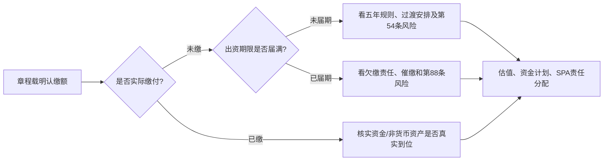
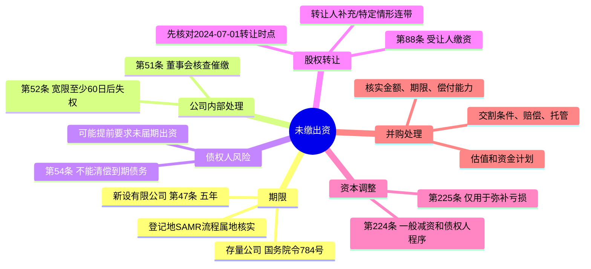

## 第二课：认缴资本与股东责任如何改变并购估值

### 1. 先把“注册资本”翻译成普通话

**注册资本**是股东承诺向公司投入的资本金额，不一定等于公司银行账户里现在有的钱。股东认缴 1,000 万元、目前只缴了 200 万元，剩下的 800 万元仍是出资义务，不是“公司已经拿到的 800 万元现金”。

对买方来说，未缴出资像一笔可能需要补上的资本承诺。它会影响目标公司未来现金需求、买方的收购后融资计划和估值。若公司不能清偿到期债务，未到出资期限的股东也可能被要求提前缴资。因此，不能只看“注册资本很大，所以公司很值钱”，而应核实**认缴、实缴、期限、资产质量和偿债能力**。

### 2. 五年出资期限：新设公司和存量公司分开看

《公司法》第47条规定，有限责任公司全体股东认缴出资原则上应自公司成立之日起五年内缴足；法律、行政法规或国务院决定对特定行业另有规定的，从其规定。此处的五年是**新设有限责任公司自成立日起的认缴期限上限**，不是说每个股东在公司成立当天都要一次性实缴。

对 2024 年 6 月 30 日前登记设立的有限责任公司，国务院令第784号设置过渡安排：如果从 **2027 年 7 月 1 日**起算，剩余出资期限仍超过五年，应在 **2027 年 6 月 30 日前**把剩余期限调整到五年以内，并记入公司章程。通俗记忆：给存量公司约三年调整期，之后通常最多再留五年缴足。它不等于所有存量公司必须在 2027 年 6 月 30 日前把未缴资本全部缴清。

存量股份有限公司的处理不同：发起人或股东应在 2027 年 6 月 30 日前缴足认购股份的股款。对国家利益或重大公共利益相关公司，规定设有经国务院有关主管部门或省级人民政府同意后按原出资期限出资的例外。注册资本或出资期限明显异常的，登记机关可依法要求调整。

| 公司情形 | 初步规则 | 买方核查动作 |
|---|---|---|
| 2024年7月1日后新设的有限责任公司 | 原则上自成立日起五年内缴足 | 逐股东核对认缴额、方式、期限和实缴凭证 |
| 2024年6月30日前已设立的有限责任公司 | 看 2027年7月1日起的剩余期限；超过五年的，须在 2027年6月30日前调整至五年内 | 核对是否需要修章、决议、登记/公示，以及是否有异常资本问题 |
| 2024年6月30日前已设立的股份有限公司 | 发起人/股东应在 2027年6月30日前缴足认购股款 | 查股份认购记录、缴款凭证、公司类型及适用例外 |
| 特定行业或特别规定公司 | 可能适用特别出资要求 | 查行业法、行政法规和国务院决定，不直接套普通五年规则 |

**属地登记办理怎么学**：全国规则确定期限，但登记地市场监督管理部门（SAMR）的材料清单、系统填报和“明显异常”处理会因具体情况及地方公开指南而异。交易尽调应查看公司登记地 SAMR 的当期办事指南，必要时向登记窗口确认：修章/股东决议、变更或备案办理顺序、国家企业信用信息公示系统更新方式，以及增资、股权转让或组织形式变更时怎样处理出资期限。应把确认结果和日期记入交易档案；不要把个别窗口口头答复说成全国统一规则。

### 3. 四条核心规则：核查、失权、加速、转让

#### 第51条：董事会要核查和催缴

董事会应核查股东出资情况；发现股东未按公司章程规定的期限足额缴纳出资，公司应向该股东发出书面催缴书。负有责任的董事未及时履行核查、催缴义务并给公司造成损失的，可能承担赔偿责任。

**并购里怎么用**：索取章程、出资明细、董事会决议、催缴书、送达证据和财务账簿。董事会从未核查，不只是治理文件不齐，也可能意味着欠缴问题长期未被处理。

#### 第52条：欠缴不等于自动失去股权

经书面催缴后，股东仍未缴纳出资的，公司可以在催缴书载明的宽限期届满后，经董事会决议发出书面失权通知；宽限期不得少于 60 日。股东自失权通知发出之日起丧失其未缴纳出资对应的股权。股东可在收到通知后 30 日内向人民法院起诉。

失权股权应依法转让，或通过减资注销；六个月内未转让或注销的，由其他股东按其出资比例足额缴纳相应出资。**重点：**催缴、宽限期、董事会决议和通知都要走；失权针对未缴出资对应部分，不应理解为董事会可以不经程序没收股东的全部权益。

#### 第54条：不能清偿到期债务时可能加速到期

公司不能清偿到期债务的，公司或者已到期债权的债权人，可以要求尚未届出资期限的股东提前缴纳出资。条文没有要求公司先进入破产程序，但也不是“有任何一笔逾期就自动加速”：需要看公司是否不能清偿到期债务及具体请求和证据。

**尽调红旗**：到期借款、拖欠供应商款、执行案件、持续现金流缺口、债权人催收、未完成的出资和股东抽逃/资金占用。对买方的后果是原本排在未来的资本缴付义务，可能提前变成近期现金需求。

#### 第88条：未届期股权转让后，出资责任不会凭转让消失

- 转让**未届出资期限**的股权：受让人承担缴纳该出资的义务；受让人未按期足额缴纳时，转让人承担补充责任。
- 转让**已逾期未缴**或出资存在瑕疵的股权：转让人与受让人在出资不足范围内承担连带责任；受让人不知道且不应当知道瑕疵的，按第88条相应规则由转让人承担责任。

第88条第一款有明确的时间效力问题。最高人民法院法释〔2024〕15号批复明确，该款适用于 **2024年7月1日之后发生的未届出资期限股权转让行为**。分析历史交易时，先确定转让行为发生日期，不可把新法第一款机械追溯到 2024 年 7 月 1 日前的转让。

### 4. 两种减资：不要把“减资”当成快速清理工具

| 项目 | 一般减资：第224条 | 弥补亏损减资：第225条 |
|---|---|---|
| 目的/性质 | 一般调整注册资本 | 公司先用公积金弥补亏损后仍有亏损时，为弥补亏损而减资 |
| 比例 | 有限责任公司原则上按股东出资比例减；股份有限公司原则上按持股比例减。法律、章程另有规定，或有限责任公司全体股东另有约定的除外 | 按第225条特别程序处理，不得向股东分配财产或免除缴资义务 |
| 债权人保护 | 编制资产负债表和财产清单；决议后10日内通知债权人、30日内公告。收到通知30日内、公告45日内，债权人可要求清偿或担保 | 不适用第224条第二款通常的个别债权人通知程序；股东会作出决议后30日内公告 |
| 其他限制 | 需履行债权人保护及公司登记程序 | 不得向股东分配财产，不得免除股东缴纳出资或股款义务；法定公积金与任意公积金累计达到注册资本50%前不得分配利润 |

**交易应用**：如果资本结构过大，减资可能是方案之一，但要看债权人程序、股东一致同意、公司偿债状况、公告和登记时间。用弥补亏损减资不能把尚未缴纳的股东出资义务一笔勾销。

### 5. 控制权穿透与关联交易：三个条款不要混为一谈

公司法上的责任分析不是“谁控股谁负责”。要识别行为、程序、损害和因果关系：

| 条文 | 入门理解 | 需要的事实线索 |
|---|---|---|
| 第180条第3款 | 控股股东、实际控制人虽不任董事，但**实际执行公司事务**的，适用董事忠实、勤勉义务规定 | 谁决定预算、任免、重大合同、资金调拨、技术或关联交易？仅持股或影响力不当然等于实际执行事务 |
| 第182条 | 董事、监事、高管及其关联方与公司交易，须报告并按章程获董事会/股东会批准 | 关联方关系、报告、批准、回避、定价公允性、公司损失。不是所有关联交易当然无效 |
| 第192条 | 控股股东、实际控制人**指示**董事或高管实施损害公司/股东利益的行为时，与该董事/高管承担连带责任 | 指示证据、具体实施行为、损害和因果关系。不是控制人对公司全部债务当然连带负责 |

### 6. 从规则走到估值：一个完整例子

目标有限责任公司于 2022 年成立，注册资本 5,000 万元，唯一股东认缴 5,000 万元，章程约定 2035 年缴足；截至尽调日实缴 500 万元。目标欠银行到期贷款 800 万元，拖欠供应商 200 万元，核心设备评估约 3,000 万元。买方计划收购 100% 股权。

按步骤分析：

1. **先看期限**：这是存量有限责任公司。2035 年到期显著超出过渡安排可能允许的期限，需评估在 2027 年 6 月 30 日前修章调整；并确认登记地办事要求。
2. **再看近期偿债**：欠款是否已到期、公司能否清偿？如不能清偿到期债务，银行或公司可能依第54条请求未到期出资提前缴纳。
3. **检查治理程序**：董事会是否依第51条核查/催缴；如已发催缴书，是否有至少60日宽限、董事会失权决议和书面通知等第52条程序。
4. **算真实资本负担**：认缴未缴 4,500 万元不必然等于收购日立刻要支付 4,500 万元；但公司法定出资义务和加速到期风险必须进入资金计划、估值与交易谈判。
5. **设计合同处理**：确认卖方需否先补缴、买方是否接受受让缴资义务、价格如何调整、是否设专项赔偿/托管、是否把修章/偿债/出资证明设为交割条件。合同内部分配不能消灭公司或债权人依法可主张的权利。

### 7. 买方尽调和 SPA 清单

| 尽调要件 | 需要拿到的材料 | 交易文件中的处理 |
|---|---|---|
| 认缴与实缴 | 最新章程、股东名册、登记档案、出资流水、非货币出资评估和权属材料 | R&W：认缴额、实缴额、期限、出资真实性；对瑕疵设置专项赔偿 |
| 到期债务和偿债能力 | 借款合同、应付账款账龄、催款函、诉讼/执行、现金流预测 | 条件先决：清偿特定债务/取得豁免；专项赔偿；价款留置/托管 |
| 催缴、失权 | 董事会记录、催缴书、送达凭证、失权通知、后续转让或减资文件 | 要求卖方保证未存在未披露程序；必要时交割前完成纠正 |
| 存量期限调整 | 公司设立日期、出资期限、章程修订、属地 SAMR 公示/办理记录 | 设为交割前行动或交割后限期义务，明确责任人、期限和失败后果 |
| 未届期股权转让 | 转让日期、股权转让协议、受让人尽调和知情记录 | 依新法第88条和法释〔2024〕15号确定法定责任，再约定买卖双方内部补偿 |

**三个不同工具**：

- **Condition Precedent（交割先决条件）**：风险在交割前必须解决，否则买方可不交割，例如取得关键同意或完成特定出资整改。
- **Specific Indemnity（专项赔偿）**：风险交割前难以消除，双方约定风险发生后由卖方承担，例如已识别的历史欠缴出资或税款。
- **Escrow / Retention（托管/留置价款）**：卖方承诺赔偿但可能没有足够偿付能力时，预留部分价款作为可实际取得的资金来源。

### 8. 对应真题：原题事实和现行法叠加要分开

| 真题 | 原题考什么 | 新公司法如何作为“现行法加练” |
|---|---|---|
| Clifford Chance / 高伟绅，Question 2 | 目标公司存在欠税、社保公积金不足、许可缺失、账外资金流和25%代持；比较股权交易、资产交易，并分析代持救济 | 原题不是围绕五年出资制编写的。今天做题时，可额外请求注册资本、实缴证明、董事核查/催缴资料；将第54、88条风险加入估值及 SPA，但要把它标作现行法更新，不要声称是原题直接考点 |
| Baker McKenzie，2014 JV 案例 | 50:50 合资、增资需一致同意、中方关联交易及僵局退出 | 用第180条第3款、第182、192条分析控制和关联交易，但必须证明对应构成要件；资本调整仍看章程和法定程序。第224/225条只能在相应事实和程序满足时作为资本重整选项 |
| 中伦 2017 外资并购题 | 10% 商场公司口头代持、想显名并问外资准入和手续；另考 R&W 与责任限制 | 原题按其题目时点作答；现在补充核对新公司法股东名册/股权转让、出资状态、现行负面清单和登记。不要将新规则倒推成旧题当年答案 |

### 9. 第二课英文答题练习

**题目**：The Target is a PRC limited liability company incorporated in 2022. Its articles provide that a shareholder’s RMB 40 million capital contribution is due in 2034, but only RMB 5 million has been paid. The Target has overdue bank debt. The Seller proposes to transfer all of its equity to the Purchaser before Completion. Identify the principal PRC Company Law issues and recommend deal protections.

**答题骨架（先尝试自己写，再对照）**：

> **Conclusion.** The unpaid RMB 35 million is a material funding and liability issue and should be reflected in the valuation and closing plan. The Purchaser should not assume that the 2034 payment date eliminates near-term exposure. We would first confirm the Target’s ability to pay its due debts, the applicable transitional contribution deadline and the exact date of the proposed equity transfer.
>
> **Analysis.** Under Article 47 of the PRC Company Law, a shareholder of a newly established limited liability company generally must pay its subscribed contribution within five years from incorporation. For an existing company, the transitional rules under State Council Order No. 784 must also be checked. In addition, Article 54 permits the Company or a creditor whose claim is due to require a shareholder with an unexpired contribution period to pay early if the Company is unable to pay its due debts. Under Article 88, a transferee of equity with an unexpired contribution obligation assumes that obligation, while the transferor may bear supplementary liability if the transferee fails to pay; the temporal application of Article 88(1) must be checked against the transfer date and Supreme People’s Court Reply (2024) No. 15.
>
> **Next steps.** We recommend obtaining the latest articles, contribution records, debt and enforcement information, board records and any demand notices; confirming the local SAMR filing requirements for any amendment; and agreeing whether the Seller must pay the amount before Completion. If the risk cannot be cleared, the SPA should specify the contribution allocation, include a tailored indemnity and an escrow or retention, and make any essential debt or registration cure a condition to Completion.

### 10. 第二课自测卡

不看正文，试着用自己的话回答：

1. 为什么认缴资本不等于公司现金？
2. 存量有限责任公司 2027 年 6 月 30 日前必须做什么？哪些公司另有缴款截止要求？
3. 第54条触发的关键表述是什么？是否必须先破产？
4. 第52条失权前至少要经历哪些程序？
5. 未届期股权转让时，受让人和转让人责任如何分？先看哪个日期？
6. 第225条弥补亏损减资能否免除未缴出资？
7. 哪种事实能把实际控制人带入第180条第3款？哪种事实对应第192条？

