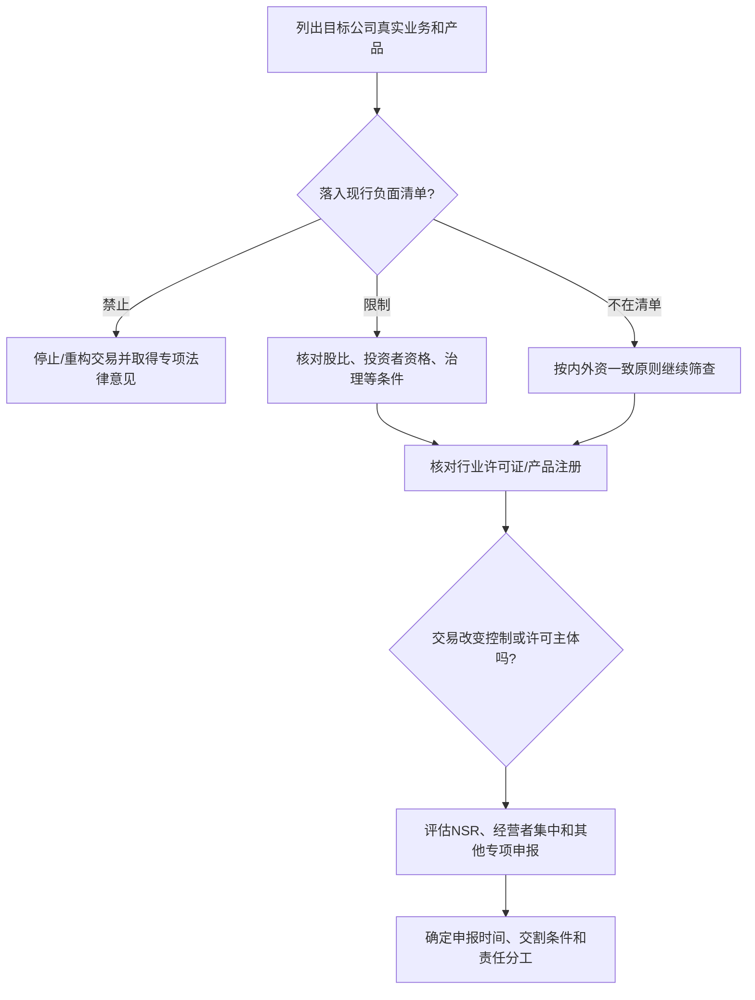
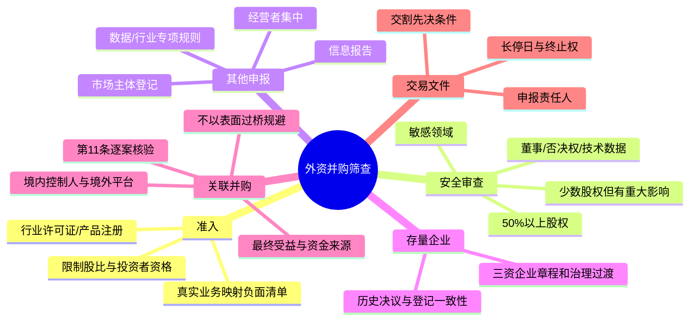

## 第三课：外商投资准入与并购监管怎么排查

### 1. 外资准入不是一个“能/不能”的单一问题

初学者最容易把外资监管压成一句话：“这个行业允许外资吗？”实务上至少要分开回答四层：

1. **准入负面清单**：行业是否禁止外商投资，或有持股比例、投资者资格、管理层等特别限制？
2. **行业许可**：无论股东是否外资，经营主体是否需要取得许可证、备案或产品注册？控制权变化是否要报告或重新审查？
3. **外商投资安全审查（NSR）**：交易是否进入敏感领域并使外国投资者取得实际控制权？
4. **其他并购申报**：是否触发经营者集中申报、国资交易、数据/技术、土地、环保、金融或其他专项审查？

所以“负面清单以外”只说明外资准入通常按内外资一致原则管理，不表示没有其他监管。

### 2. 负面清单：从“实际经营”开始，不从公司名字开始

《外商投资法》第4条确立准入前国民待遇加负面清单管理制度；第28条规定，负面清单以外的领域原则上给予国民待遇，清单内则按其列明的禁止或限制措施管理。适用时看交易实施时有效的全国版及（如适用）自贸试验区版负面清单。

**筛查顺序：**

1. 把目标的产品、服务、客户、收入来源、关键技术和实际运营地点写出来。
2. 将每项业务映射到相关行业分类和负面清单条目，不能只看营业执照上的宽泛经营范围。
3. 核对限制项目是否规定外资持股比例、投资者资格、中国籍负责人或其他条件。
4. 核对目标是否同时受行业许可约束，例如医疗器械经营、增值电信、金融、教育或文化等。
5. 评估收购后的业务计划是否新增了限制行业、许可或外资控制问题。

**初学者要记住：** 同一家公司可能同时经营清单内和清单外的业务。此时要看业务能否拆分、收入和资产是否交叉，以及限制行业的经营主体和股权结构能否满足要求；不能只选对自己有利的一行清单就结束分析。

### 3. 信息报告、审批与登记：概念不要混用

《外商投资法》第34条建立外商投资信息报告制度，外国投资者或外商投资企业按规定通过企业登记系统和企业信用信息公示系统报送投资信息。信息报告不是对所有外资项目重新设置传统的逐项商务审批。另一方面，市场主体设立/变更登记、行业许可、反垄断申报和安全审查仍分别存在。

可以把概念记成：

| 名称 | 通俗解释 | 并购里会问什么 |
|---|---|---|
| 信息报告 | 向主管系统报送投资信息 | 初始报告、变更报告和年度报告由谁、何时提交？ |
| 市场主体登记 | 变更股东、注册资本、法定代表人等登记事项 | 哪些交割文件和登记申请必须提交？ |
| 行业许可/备案 | 获得经营特定行业/产品的资格 | 股东或控制权变化是否要批准、报告或重新办证？ |
| 经营者集中申报 | 并购达到法定申报条件时向反垄断机关申报 | 申报门槛、停钟义务和交割前等待期是什么？ |
| 安全审查 | 保护国家安全的投资审查 | 是否触发强制申报？能否把审查作为交割条件？ |

### 4. 国家安全审查（NSR）：行业与控制权一起看

《外商投资法》第35条规定国家建立外商投资安全审查制度。现行主要程序规则为国家发展和改革委员会、商务部令第37号《外商投资安全审查办法》，自2021年1月18日起施行。

**第一问：是什么领域？** 办法涵盖军工及军工配套、军事设施周边等投资；也涵盖重要农产品、能源和资源、重大装备制造、重要基础设施、交通运输、文化、信息技术和互联网产品与服务、金融服务、关键技术等领域的投资。这里的“重要”“关键”需要按业务实际和适用监管口径判断，不能看到“科技公司”四个字就直接下结论。

**第二问：外国投资者是否取得实际控制权？** 规则包括持有 50% 以上股权；持股低于 50%但所享有的表决权足以对董事会或股东会决议产生重大影响；以及外国投资者通过其他安排对经营决策、人事、财务、技术等产生重大影响的情形。

因此，控制权不只看股比。尽调和文件审阅还要看：

- 董事/观察员席位和董事任免权；
- 对预算、商业计划、关键合同、融资、技术和数据的否决权；
- 协议控制、委托投票、表决权安排和一致行动；
- 对管理层任免、财务账户和关键人员的实际影响；
- 外资买少数股权但同时取得运营协议、技术访问权或关键决策权的安排。

如命中申报范围，应在投资实施前向工作机制办公室申报。交易文件应为审查设置先决条件，并处理审查导致的禁止投资、附条件通过、交易范围调整、长期停止日和终止权。不要先交割、再把安全审查当作补手续。

### 5. 老“三资企业”：2024年过渡期结束后重点查什么

《外商投资法》第31条规定外商投资企业的组织形式、组织机构及其活动准则适用《公司法》《合伙企业法》等法律；第42条废止原外资企业法、中外合资经营企业法和中外合作经营企业法，并给存量企业五年调整期。相关实施条例第44条衔接既存外商投资企业的组织形式和组织机构调整。五年过渡期于 **2024年12月31日**届满。

以往中外合资企业可能由董事会作为最高权力机构，重大事项需一致通过。过渡后，有限责任公司治理应与现行《公司法》股东会、董事会（或依法设立的审计委员会等）、经理层和章程安排衔接。

尽调至少收集并核对：

1. 营业执照、登记档案和现行章程是否一致；
2. 章程是否已将原合资企业的董事会权力、表决门槛、任命方式转成适配现行公司法的治理条款；
3. 股东会/董事会决议是否按新章程、现行公司法作出；
4. 法定代表人、董事、高管、监事或审计委员会安排是否完成登记/备案；
5. JV 合同、章程、股东协议中是否仍有与强制性公司治理规则冲突的旧条款。

未按期调整不是一句“全部历史决议自动无效”就能概括的。应逐项看企业登记状态、章程、决议形成程序、第三人交易和具体争议；在可行时，将治理文件整改列为签约后交割前事项或交割后限期承诺。

### 6. “10号文”第11条：识别关联并购，不设计表面规避

商务部等部门发布的《关于外国投资者并购境内企业的规定》（常称“10号文”；2009年修订文本为商务部等六部委令2009年第6号）是历史题库中常见的外资并购规则。第11条关注中国境内公司、企业或自然人通过其设立或控制的境外公司并购与其有关联关系的境内公司，要求依该条报商务主管部门审批。实质问题是：境内权益持有人是否借境外平台回到境内收购关联企业，从而改变投资者身份或绕开监管。

处理这类题时按“关系—控制—交易实质—程序”四步：

1. **关系**：境内卖方、实际控制人、收购平台、融资人之间是否有关联或共同控制？
2. **控制**：境外公司由谁设立、出资、控制或代持？谁享有收益和决策权？
3. **实质**：是否属于返程投资/关联并购，是否改变外资准入、审批或监管结果？
4. **程序**：需要何种审批、登记、信息报告或主管机关确认？交割前能否完成？

“过桥换籍”“让无关联第三方先收购再转给关联方”“买断后重组”不能被当作当然合法的规避办法。若控制关系和商业实质没有真实改变，仍可能有审批、披露、登记、交易效力和交割风险。正确的学习结论是识别红旗、完整披露最终控制与资金来源、逐案核验适用规则，并评估真实合规的替代结构。

### 7. 第16条付款规则：作为旧规则处理，先核现行适用

10号文第16条是历史题中常考的股权并购对价付款期限规则：通常要求自外商投资企业营业执照颁发之日起三个月内付清购买金；经批准分期支付的，六个月内支付不少于 60%，一年内付清。应按第16条原文及交易类型确认具体适用条件。

做题时不要把路线图中的“付清前一律不得行使表决权、不得并表”不加区分地当成一般现行结论。真实交易应核实该条对具体并购路径的现行效力、是否适用及与现行登记、信息报告、外汇和会计规则的衔接；同时区分**公司法上的股东权利、外资并购程序、会计控制判断和对价支付义务**，它们不是同一个问题。

### 8. 外资并购的简易筛查表

| 问题 | 核心文件/事实 | 可能的交易处理 |
|---|---|---|
| 目标每一项实际业务是否在负面清单？ | 产品/服务、收入、业务流程、客户、运营实体 | 调整范围、股权比例、投资者或交易结构；禁止领域则停止或另寻合法方案 |
| 是否需要行业许可/产品注册？ | 许可证、证照条件、监管往来、股东/控制人条款 | 变更/重新申请；将批准设为交割条件；设过渡运营方案 |
| NSR 是否触发？ | 行业、持股、表决权、董事席位、否决权、技术/数据权限 | 交割前申报和等待；设安全审查条件、长期停止日和终止机制 |
| 是否需经营者集中申报？ | 交易各方营业额、控制权、交易结构 | 由指定一方负责申报；未获批前不提前实施集中 |
| 老三资企业治理是否整改？ | 章程、历史决议、登记档案、董事会/股东会记录 | 签约前或交割前修章、补决议和更新登记 |
| 是否存在境内权益通过境外平台关联并购？ | 最终控制人、资金来源、代持、关联方结构图 | 进行第11条及其他外资规则核验；不以形式变更掩盖真实控制 |

### 9. 对应真题：练“把监管写成条件和步骤”

| 真题 | 题面考点 | 今天怎样复习 |
|---|---|---|
| 中伦 2017 外资并购团队 B 卷 | 外国公司拟收购广州购物中心公司 10% 股权；此前由境内个人口头代持；问商业地产是否允许外资持股、如何显名和要走哪些批准/登记 | 原题按2017年背景答；再做现行法更新：查当日负面清单和具体商业/物业管理业务、公司章程及其他股东权利、信息报告、登记、资金路径、代持清理与控制权/安全审查。不要把“商业地产”抽象为一个统一准入答案 |
| 中伦 2017 同卷医疗器械题 | 澳大利亚公司想设贸易型 WFOE 进口和销售医用手套及矫正隐形眼镜 | 分开外资准入、企业设立、医疗器械产品分类/注册备案、经营许可/备案、进口及产品上市要求；2017年的审批路径不能照抄为现行流程 |
| Baker McKenzie 50:50 JV | 股东争论继续增资，章程对增资和重大事项有不同表决门槛 | 叠加老三资企业过渡整改：核对现行章程和公司法机关权限；把治理整改、关联交易调查、融资计划分成不同工作流 |
| Clifford Chance 收购中国电梯公司 | 题面以并购尽调和结构为主，同时有国资背景、代持和经营许可风险 | 再补查行业许可、外资准入、国资交易历史及监管批准；不要把一份股权转让协议当作全部审批路径 |

### 10. 第三课英文答题练习

**题目**：A foreign investor proposes to acquire 40% of a PRC technology company. It will appoint two of five directors, has veto rights over the annual budget and key technology transfers, and will receive access to sensitive technical data. What should you assess before advising that the investment can proceed?

**答题提示**：不要第一句就回答“40%低于50%，所以没有控制”。应分别核对负面清单、实际经营和行业许可；结合持股、董事席位、预算/技术否决权分析是否取得实际控制；评估目标业务是否落入《外商投资安全审查办法》的重要领域；另查经营者集中、数据与技术规则；说明申报或许可如何进入交割时间表。

**参考开头**：

> We would not conclude that the investment is outside the foreign investment security review regime solely because the investor will hold 40%. The proposed board representation, budget vetoes and access to technical information may be relevant to whether the investor can exert material influence over the company’s operations, technology or other key matters. We would first map the Target’s actual products and activities against the current foreign investment negative list and the sectors covered by the Security Review Measures, and then assess control by reference to the full governance and information-rights package.

### 11. 第三课自测卡

1. 为什么负面清单以外仍可能需要许可证或安全审查？
2. NSR 的分析为什么不能只看股权比例？
3. 对一家原中外合资企业，过渡期结束后要查哪些公司治理材料？
4. 第11条关联并购题应先查哪些人与实体之间的关系？
5. 为什么不能把“过桥换籍”当成通用合规建议？
6. 怎样在 SPA 中处理尚未完成的审批/安全审查？

