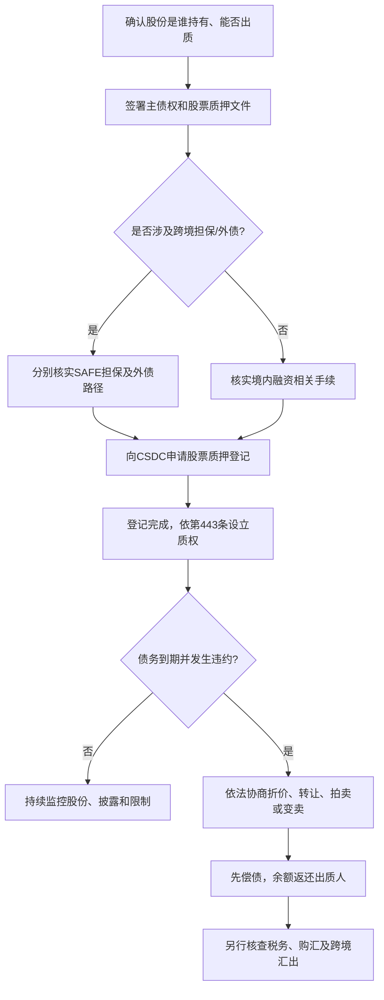
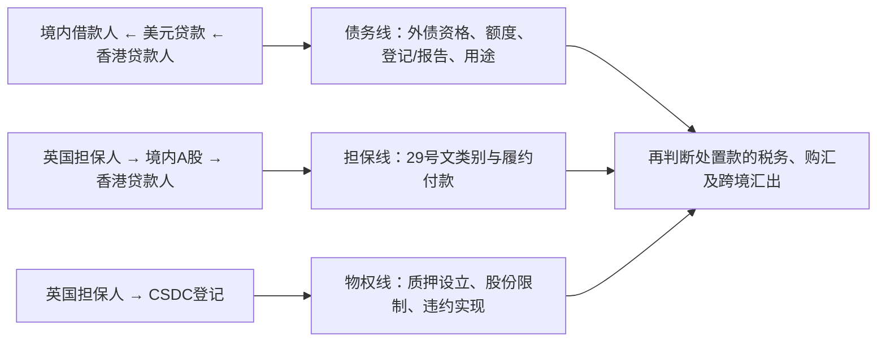

## 第五课：A 股股票质押怎样设立、执行和回款

### 1. 先分清“质押合同”和“质权”

签了质押合同，表示双方约定用某项财产担保债务；但质权是否已经设立，还要看法律要求的登记是否完成。上市公司股票属于登记结算体系中的证券，通常要按适用规则在中国证券登记结算有限责任公司（**CSDC**）办理质押登记。

《民法典》第443条规定，以基金份额、股权出质的，质权自办理出质登记时设立。上市股票的具体登记账户、申请资格、文件要求和可办理性，要按股份性质及 CSDC 当时有效的业务规则核实。不要把这项登记和 SAFE 的跨境担保登记/数据报送混为一谈。

### 2. 设立前先核对五件事

1. **谁是出质人？** 核对证券账户、持股凭证、实际权利人以及股份是否由代持、信托或其他安排持有。
2. **是哪种股份？** 核对上市地、股份类别、限售/锁定状态、冻结、已有质押、减持限制和公司行为影响。
3. **谁能登记？** 境外股东持有或处分境内上市股份的法律路径、账户条件和 CSDC 办理资格需要专项核实。
4. **担保什么债务？** 写清主债务人、债权人、币种、利息、费用、担保范围和担保期间，确认是否覆盖将来债务或最高额安排。
5. **还需要哪些并行程序？** 若交易有跨境因素，另行核对 29号文分类、外债管理、上市公司信息披露和股东权益变动规则；不能期待一个登记同时解决所有问题。

质押文件应把股份识别信息、担保债权范围、违约事件、通知、补救期、处置协作、处置所得分配和剩余款项返还写清。若股份价值波动显著，交易双方还要设计补充担保、维持担保比例、违约处置时限等商业机制，并确认该等机制与证券及外汇规则兼容。

### 3. 违约时可以怎样实现质权？

先分清“自动归属”和“到期后依法处置”。《民法典》第428条规定，债务履行期限届满前约定债务人不履行时质押财产直接归债权人所有的，质权人只能依法就质押财产优先受偿，不能把该约定当成到期即自动取得股票所有权的通行许可。

债务到期后，《民法典》第437条允许质权人与出质人协议将质押财产折价，或者以拍卖、变卖所得价款优先受偿；第438条要求处分价款超过债权数额的部分返还出质人，不足部分仍由债务人清偿。选择何种路径还需满足上市证券交易、股份转让、登记结算和可能适用的外资准入规则。协商不成或需要强制执行时，法院执行程序可能成为实际路径，但不能因此概括成“所有股票质押只能司法拍卖”。

**容易丢分的绝对化说法：**

- “签了质押合同，质权就成立。”需要确认法定登记是否完成。
- “违约后股票当然归境外债权人。”自动取得所有权不能只靠到期前约定实现；受让资格和证券规则也要另查。
- “任何以股抵债都绝对禁止。”要区分债务到期前的自动归属条款与债务到期后依法协商折价、处置及优先受偿。
- “只能法院司法拍卖。”具体实现方式受事实、股份状态、当事人合作及证券规则影响。

### 4. 处置款可以直接汇到境外吗？

不能在合同里无条件承诺“拍卖所得自动购汇汇出”。质权如何实现、股份如何转让、价款如何结算、所得属于谁、是否涉及税费，以及经办银行能否凭现有文件办理购汇和汇出，都是不同问题。境外债权人也不一定有资格直接持有或受让该类 A 股。

从交易准备角度，建议在签约前让境内律师、境外律师、银行和 CSDC 办理团队分别确认：

| 问题 | 需要取得的答案/材料 |
|---|---|
| 质押是否有效设立？ | 质押合同、CSDC 登记回执、证券账户及股份状态证明 |
| 违约事件如何证明？ | 主债权文件、到期证明、违约通知和送达记录、未偿债金额计算 |
| 采用何种处分方法？ | 质权实现协议、股份估值/处置方案、交易或执行文件、必要的法院文书 |
| 能否由境外主体受让股份？ | 受让人资格、外资准入、控制权变化、安全审查、权益变动披露及交易限制分析 |
| 处分款如何跨境支付？ | 价款来源、税务文件、外汇登记/报送资料、银行要求的购汇及汇出支持文件 |

因此，最稳妥的答题表达是：**先确认质权实现路径在民商法和证券规则下可执行，再独立确认处分所得跨境支付的外汇路径。**法院文书可能是某些执行或付款路径所需文件，但不可未经核实说成唯一或普遍必要条件。

### 5. 把高伟绅真题画成三条线

题面是：香港贷款人向境内借款人提供美元贷款，英国担保人用其持有的中国上市公司股份提供质押。不要把题目压缩成“境内股票质押属于内保外贷”。应分三条线作答：

**一句话复述**：外债登记管跨境借款，29号文管跨境担保的外汇监管分类和相应办理，CSDC 登记管股票质权设立；违约实现和款项汇出还要各自通过法律与操作审查。

### 6. 英文口头答题骨架

> **I would analyse the offshore loan, the cross-border guarantee and the PRC share pledge as separate workstreams.** The PRC Borrower’s offshore borrowing requires a separate analysis of its foreign-debt capacity, registration or reporting obligations and permitted use of proceeds. The locations of the UK security provider, the PRC Borrower and the Hong Kong Lender should be mapped against SAFE Circular 29 before the guarantee is classified.
>
> **The pledge over the listed shares should be perfected under PRC law.** Under Article 443 of the PRC Civil Code, the pledge is established upon the required registration, which for listed shares is generally made through CSDC under the applicable rules. The documents should not treat a pre-default automatic transfer of the shares as an agreed enforcement shortcut.
>
> **Enforcement and remittance should then be assessed separately.** The parties may consider a legally compliant discount, sale or auction after the secured debt becomes due, subject to the Civil Code, securities rules, transfer restrictions and the pledgee’s eligibility to acquire the shares. The ability to convert and remit the proceeds offshore should be confirmed with the handling bank against the applicable foreign-exchange requirements and supporting documents.

### 7. 第五课自测

请在 90 秒内回答：

- 股票质押合同签署后，为什么还要办 CSDC 登记？
- 《民法典》第428条与第437条处理的分别是什么？
- 为什么“质权登记完成”不等于“SAFE 外汇手续完成”？
- 违约后，为什么不能事先保证境外贷款人一定能取得股票或把款项汇出？
- 高伟绅真题应分成哪三条监管/法律线？

**参考答案要点**：第443条规定登记设立质权；第428条处理债务到期前约定自动归属的效力限制，第437条处理债务到期后的折价、拍卖或变卖实现；SAFE、外债与证券质押登记各自解决不同监管或物权问题；受让资格、股份限制、处置方式和银行审核均可能影响执行和汇出；三条线是债务、跨境担保、股票质押/物权实现。