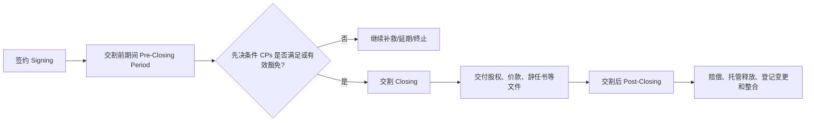

## 第六课：SPA 从签约到交割怎样工作

### 1. 先把 SPA 想成一条时间轴

**SPA（Share Purchase Agreement）** 是股权买卖协议。它不只是写“多少钱买多少股”，而是把交易从签字推进到交割，再把交割后的未知风险分配清楚。



初学者先记三个时间点：

| 时间点 | 主要问题 | 常见文件位置 |
|---|---|---|
| 签约前/签约时 | 交易是否可签？价格和风险是否谈妥？ | Term Sheet、SPA、披露函、监管申报方案 |
| 签约至交割 | 目标公司能否保持正常经营？监管和第三方同意是否取得？ | Covenants、CP 清单、过渡期经营承诺 |
| 交割后 | 未披露风险发生怎么办？价款是否需要扣留？ | R&W、Specific Indemnity、Escrow、Claims 条款 |

### 2. 一份入门版 SPA 目录

1. **Definitions and Interpretation**：定义和解释规则。先统一“Business Day”“Material Adverse Effect”“Loss”等词的含义。
2. **Sale and Purchase**：出售和购买的股份数量、比例、权利状态和价款。
3. **Conditions Precedent（CPs）**：交割前必须完成的事项，例如监管批准、第三方同意、解除质押、关键许可取得。
4. **Pre-Closing Covenants**：签约后到交割前，卖方如何经营目标公司、哪些事项需买方同意。
5. **Representations and Warranties（R&W）**：双方对事实、权利和合规状态作出的陈述与保证。
6. **Disclosure and Disclosure Letter**：卖方如何披露 R&W 的例外事项；披露是否足够具体，会直接影响买方日后索赔。
7. **Indemnities and Limitations**：一般赔偿、专项赔偿、责任上限、免赔额、时效和重复赔偿限制。
8. **Closing Mechanics**：交割日、交付文件、价款支付、股权登记和董事/法定代表人变更。
9. **Termination**：长停日、重大违约、CP 未满足、监管被拒和终止后的责任。
10. **Boilerplate**：通知、保密、转让、完整协议、修订、适用法律和争议条款。

不要把目录当成死记清单。每个章节都应回答一个实际问题：**交易能否完成、完成时交付什么、风险发生后谁承担。**

### 3. CP：什么时候可以不交割？

**Condition Precedent** 是交割先决条件。它不是普通的“卖方承诺”，而是交割义务是否到来的开关。常见 CP 包括：

- 适用的反垄断、国家安全审查、行业许可、国资或外商投资手续已经完成；
- 目标公司或标的股份的质押、冻结、查封已经解除；
- 关键合同、技术许可、租赁或融资文件所需的控制权变更同意已经取得；
- 股东会、董事会、监管机关和第三方批准已经取得；
- 卖方 R&W 在签约日和交割日仍真实、准确，且不存在约定的重大不利变化；
- 买方已准备足额交割资金，卖方已准备股权证书、辞任书、印章和登记文件等交割交付物。

**初学者判断方法：**如果一项事项不完成，买方是否依法或商业上根本不能取得目标？如果答案是“是”，它更像 CP；如果只是卖方对未来行为的要求，通常应放在 covenant 或 indemnity 中。某些事项可以通过“waiver”豁免，但要规定谁能豁免、是否必须书面、豁免是否只针对一项具体 CP。

CP 条款要写清：责任人、文件标准、截止时间、是否可豁免、未满足时谁承担费用，以及长停日届满后的终止权。不要只写“取得所有必要批准”，却不列批准名称和判断标准。

### 4. R&W、披露和尽调是什么关系？

可以用一句话理解：**尽调是买方查事实；R&W 是卖方把关键事实写进合同；披露函是卖方列出 R&W 的例外；赔偿是事实不实或损失发生后的付款机制。**

例如卖方作出“目标公司拥有其经营所需的全部许可”的 R&W。如果披露函具体列出某张许可尚未取得，买方可能无法再主张卖方违反这一项 R&W；但买方仍可要求把许可取得设为 CP、要求价格调整，或谈一项专项赔偿。披露不能靠一句“数据室中所有文件均视为披露”无限扩大，否则买方很难判断卖方真正披露了什么。

**披露质量的四个问题：**

1. 是否明确指向具体 R&W，而不是笼统贴一堆文件？
2. 是否说明事实、金额、时间、责任主体和可能后果？
3. 买方是否能据此合理理解风险，而不是自己在数据室中猜？
4. 披露事项是否仍需要 CP、专项赔偿或价格机制？

### 5. 过渡期承诺：签约后目标公司不能被“掏空”

从签约到交割通常还有数周或数月。卖方仍控制目标公司，买方因此会要求其在正常经营范围内运营，不得未经买方同意：

- 大额借款、担保、资本支出或资产处置；
- 新增关联交易、异常分红、改变会计政策或大规模调薪；
- 处分核心知识产权、终止关键合同、改变业务范围；
- 进行重大诉讼和解、改变税务立场或放弃重大权利。

这类条款称为 **ordinary course covenant / conduct of business covenant**。买方的同意权也不能写得完全没有边界，否则目标公司日常经营会被交易拖住。好的写法会列金额门槛、重大性标准、紧急例外和回复期限。

### 6. Closing：交割不是“双方签字”这么简单

交割通常是多个交付动作同时完成的交换：

```text
卖方交付：股权转让文件、股东名册更新文件、董事/法定代表人辞任书、印章账册、监管批准和解除负担证明
买方交付：价款、付款凭证、买方授权文件、接任董事/高级管理人员文件、必要的担保或托管文件
双方共同完成：工商/市场监管变更、外商投资信息报告、税务申报、银行和证券登记、交割清单签字
```

SPA 需要规定交付顺序和“同时交换”机制：哪些文件先交由托管律师/代理人保管，什么时点视为交割完成，若某一方文件不完整另一方是否可以暂停付款。对于分期交割或部分交割，还要写明股份、价款和控制权如何分批转移。

### 7. 赔偿和托管：风险发生后从哪里拿钱？

一般 R&W 违反可能受整体责任上限、免赔额、索赔期限和最低索赔门槛限制。重大税务、环境、代持、未缴出资和许可缺失等风险，通常应单独设计 **Specific Indemnity**，明确：

- 覆盖哪些已识别事实和哪些损失；
- 是否不受一般责任上限、免赔额或披露抗辩限制；
- 卖方承担多久；
- 买方如何通知和证明损失；
- 卖方是否可以控制第三方索赔抗辩；
- 赔偿是否从托管账户直接支付。

**Escrow** 是把一部分价款交给第三方托管，达到约定日期或索赔处理完毕后再释放。它解决的是“卖方以后有没有钱赔”的执行问题，不是对卖方责任范围的自动扩大。托管比例、期限、利息、释放条件和争议款留置机制都要写清。

### 8. MAE/MAC：重大不利变化不是“买方后悔权”

**Material Adverse Effect（MAE）** 通常用来判断目标公司、业务或交易完成能力是否发生重大不利影响。谈判时要回答三件事：

1. 影响对象是什么：目标公司整体、特定业务，还是卖方履约能力？
2. 影响要达到什么程度：重大、持续、可合理预期，还是只要金额超过门槛？
3. 哪些普遍事件应排除：宏观经济、行业变化、战争、疫情、法律变化或证券市场波动是否属于 carve-out？如果该目标受到的影响明显比同行更严重，买方通常会要求加入“但对目标造成不成比例影响的除外”这一回拨。

初学者不要把 MAE 写成“任何不利变化”。卖方会要求排除普遍性风险，买方会争取把目标特有的严重影响保留下来。MAE 还应与交割日 R&W bring-down、终止权和经营承诺相互协调，避免同一事实在多个条款下产生冲突。

### 9. 一个简化的风险放置表

| 发现的事实 | 优先放在哪里 | 为什么 |
|---|---|---|
| 关键外资/行业许可尚未取得 | CP + 过渡期 covenant | 没许可可能不能合法交割或经营，先解决能否完成交易 |
| 已知欠税金额可估算 | 价格调整或专项赔偿 + 托管 | 风险已知，适合定价并确保有资金来源 |
| 目标存在未解释的关联方付款 | R&W + 专项赔偿 + 交割前清理 | 需要查明事实，必要时把清理或返还列为 CP |
| 一般经营波动 | MAE 定义和普通经营承诺 | 不应让一般市场风险变成任意退出权 |
| 卖方可能在交割后缺乏偿付能力 | Escrow、保留价款、母公司保证 | 解决赔偿的可回收性 |

### 10. 真题映射：高伟绅电梯公司收购题

目标公司存在代持、许可缺失、欠税、社保公积金不足和账外资金。初学者可以这样安排合同答案：

1. 先把代持清理、股权权属和解除负担列为交割前事项；不能只写一项一般 R&W。
2. 对许可缺失，先判断能否在交割前取得；若不能，考虑资产交易、延后交割，或把取得许可设为 CP 并设计失败退出机制。
3. 对欠税、社保和账外资金，要求具体披露、金额估算、专项赔偿和足额托管；账外资金还要继续核查是否存在合规、税务或刑事风险，不能用赔偿条款替代事实调查。
4. 对代持，要求显名、实际出资人、登记股东和目标公司签署清理文件，取得必要的股东会/登记配合，并处理显名过程中可能产生的税费和外资准入问题。
5. 在 SPA 中区分“一般责任上限”与这些专项风险，明确披露是否构成买方放弃权利。

### 11. 英文答题骨架：从事实到合同动作

> **Our recommendation is to convert the identified risks into transaction mechanics rather than relying solely on a general warranty package.** The nominee-shareholding issue should be cleared before Closing through a documented transfer or other legally effective restructuring, with the relevant shareholder, the Target and the beneficial owner joining the arrangements where necessary. Any required registration, tax and foreign-investment analysis should be completed as a separate workstream.
>
> **The missing licence should be treated as a gating issue.** We would either make the licence, or an agreed alternative operating arrangement, a Condition Precedent, or reconsider the transaction perimeter and timing. The tax, social-insurance and unexplained-payment exposures should be covered by targeted warranties, Specific Indemnities and an appropriately sized escrow, with clear survival periods and claims procedures.
>
> **The SPA should also protect the period between signing and Closing.** The Seller should operate the Target in the ordinary course and obtain the Buyer’s consent for specified debt, asset, related-party, licensing and personnel actions. The parties should agree a long-stop date and termination rights if a required approval or CP is not obtained.

### 12. 第六课自测

- CP 和 covenant 有什么区别？
- 为什么披露函不能简单写成“数据室所有文件均视为披露”？
- 为什么已知的欠税风险通常需要专项赔偿和托管，而不是只放在一般 R&W？
- MAE 为什么不能等同于买方随时退出？
- 交割日通常要交换哪些文件？

**参考答案要点**：CP 决定交割义务是否到来，covenant 规范签约后行为；披露应足够具体使买方理解对应风险；专项赔偿和托管分别解决已识别风险的责任范围和赔偿可回收性；MAE 通常排除普遍市场/行业事件并要求重大影响；交割需同步交换股权文件、价款、辞任/接任文件、批准和登记材料。