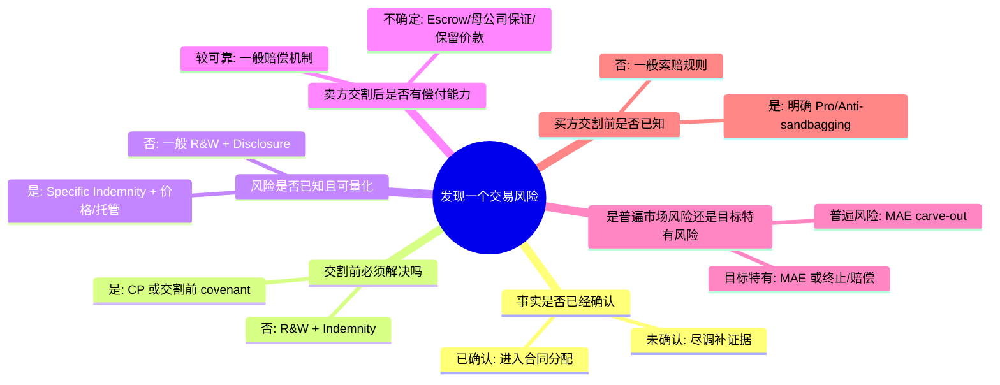

## 第七课：R&W、Specific Indemnity、Escrow、MAE 与 Sandbagging 怎样起草

### 1. 先把六个词分开

初学者最容易把这些条款混在一起。可以先记住一句话：

> **R&W 说明事实，Indemnity 分配损失，Escrow 保证将来有钱可赔，MAE 控制重大变化，Sandbagging 处理“买方早已知道却仍然交割”的索赔问题。**

| 术语 | 中文 | 它回答的问题 | 常见位置 |
|---|---|---|---|
| Representation and Warranty (R&W) | 陈述与保证 | “现在的事实是否真实、完整、不误导？” | SPA 第几条保证 |
| Indemnity | 赔偿承诺 | “如果某个风险造成损失，谁向谁付钱？” | 赔偿条款/专项赔偿 |
| Specific Indemnity | 专项赔偿 | “已知的某一项红旗由谁承担？” | 专项赔偿表或单独条款 |
| Escrow | 托管 | “卖方不付款时，买方能否先从一笔预留资金中受偿？” | 价款和托管协议 |
| Material Adverse Effect (MAE/MAC) | 重大不利影响/变化 | “交割前发生多严重的变化，买方可以不交割？” | 定义、CP、终止条款 |
| Sandbagging | 已知违约索赔规则 | “买方交割前已知保证不准确，交割后还能否索赔？” | 赔偿或解释条款 |

**学习顺序**：先读 R&W，再看披露函；发现具体红旗后，再决定用价格调整、CP、covenant、专项赔偿还是托管。不能看到任何风险都只加一条“卖方保证并赔偿”。

### 2. R&W：把“合法合规”拆成可检查的事实

R&W 是卖方（有时也包括目标公司）在签约日或交割日确认的事实。它不是抽象的道德承诺，而是将来判断违约的合同基准。

常见模块如下：

1. **主体和授权**：公司依法成立、签约和履约已取得必要授权。
2. **股权和资本**：卖方拥有目标股权，股权无质押、冻结或第三方权利；注册资本、认缴期限和实缴情况真实。
3. **财务和负债**：财务报表按约定准则编制，没有未披露重大负债或账外安排。
4. **税务、社保和公积金**：申报、缴纳、历史欠缴、追缴和滞纳金情况真实。
5. **许可和合规**：经营所需许可证有效，未收到吊销、整改或不予续期通知。
6. **重大合同、员工、知识产权、数据和关联交易**：逐项列明，不用一句“完全合法”替代事实清单。

起草时至少回答四个问题：

- 保证在 **Signing、Closing，还是两个时点** 都要真实？
- 是否有 **materiality qualifier**（重大性限定）？
- “据卖方所知”（to the Seller’s Knowledge）由谁知道、应当知道，是否包括董事和高级管理人员？
- 披露函达到什么程度才算 **fairly and specifically disclosed**（公平且具体披露）？

**Bring-down（交割日重复确认）** 很重要。若保证只在签约日作出，签约后到交割前发生的变化可能没有直接违约路径；若要求在交割日“完全准确”，卖方会担心轻微变化导致交割失败。实务上常按“除非单独约定，交割日仍在所有重大方面真实准确”并配合重大性门槛。

### 3. Indemnity：把损失计算和责任边界写清楚

普通 R&W 违约通常要证明：保证不准确、产生损失、损失与违约有因果关系，并受 SPA 的上限、免赔额、索赔期限和排除损失规则约束。**Indemnity** 可以把证明路径和责任范围写得更明确，但不会自动绕开强制性法律规则。

起草赔偿条款时按五步检查：

1. **触发事实**：是保证不准确，还是某项列明事件发生？
2. **损失范围**：税款、利息、罚款、合理律师费、第三方索赔和内部调查费用是否包括？
3. **门槛和上限**：是否适用 de minimis（单项最低额）、basket（累计免赔额）和 liability cap（责任上限）？
4. **期限**：一般索赔可能存续 12–24 个月；税务、股权权属、未缴出资和欺诈风险通常要求更长或与法定期间衔接。
5. **程序**：通知、证据、第三方索赔抗辩控制权、和解同意权、避免重复受偿和保险抵扣如何处理？

**Fundamental Warranties（根本性保证）** 通常包括主体授权、股权所有权、资本结构和税务等核心事项。买方会要求它们适用更高上限或更长存续期；卖方会要求把“根本性”定义得窄，避免所有保证都被归入例外。

### 4. 未足额实缴出资的专项赔偿和托管范本

#### 4.1 为什么不能只写一句“卖方保证资本已缴足”

2023 年《公司法》下，认缴期限、催缴、股东失权、加速到期和股权转让责任都可能影响目标价值。尤其是《公司法》第88条涉及未届出资期限股权转让后的责任分配；对历史交易还要注意相关司法解释的时间适用。初学者应先确认：

- 未缴金额、原认缴期限和公司章程记载是什么；
- 是否已经发生债权人请求、公司催缴或出资期限加速到期事由；
- 交易是由谁在交割前补缴、减资，还是由买方接手并折价；
- 目标公司、转让人、受让人是否需要共同签署确认和追偿安排。

#### 4.2 Buyer-friendly bilingual model

> **Specific Indemnity – Unpaid Capital**
>
> The Seller shall indemnify and hold harmless the Purchaser and the Company from and against all Losses arising out of or in connection with (i) any failure by the Seller or any former shareholder to make a capital contribution that was due or becomes due in respect of the Shares, (ii) any demand, claim or enforcement by the Company, a creditor or a competent authority relating to such unpaid capital, and (iii) any interest, surcharge, penalty, tax, professional fee or reasonable cost incurred in addressing the foregoing. This indemnity shall apply irrespective of any disclosure, knowledge, materiality threshold, basket or general liability cap under this Agreement, but shall not permit double recovery.
>
> **未足额出资专项赔偿**
>
> 卖方应就因下列事项产生或与之有关的全部损失向买方及目标公司赔偿并使其免受损害：（一）卖方或任何前股东未缴纳或未按期缴纳与标的股权有关的应缴或将到期出资；（二）公司、债权人或有权机关就该等未缴出资提出的要求、主张或执行；以及（三）处理前述事项发生的利息、滞纳金、罚款、税费、专业费用及合理成本。无论该事项是否已披露、买方是否知悉、是否达到重大性门槛、免赔额或一般责任上限，本专项赔偿均适用，但不得导致重复受偿。

这段文字体现买方立场。卖方通常会要求把“将到期”限定为交易文件中已经识别的金额，把罚款和内部成本排除，把专项赔偿纳入一个单独但有限的上限，并允许卖方先行补救。

#### 4.3 Escrow 配套范本

> At Closing, the Purchaser shall retain RMB [X] from the Purchase Price and deposit that amount into an escrow account with [Escrow Agent]. The escrowed amount shall secure the Seller’s obligations under the Specific Indemnity – Unpaid Capital. The amount not subject to a pending claim shall be released on the date falling [24] months after Closing. Any amount subject to a timely notified claim shall remain in escrow until the claim is finally resolved or the parties agree otherwise. Release instructions shall require joint written instructions or a final judgment, arbitral award or other enforceable decision.

中文理解：交割时从价款中预留人民币 X 元进入托管账户，仅用于担保未足额出资专项赔偿；24 个月后无争议部分释放；已及时通知的争议金额继续留存，直至最终解决。托管是回收机制，不等于买方已经证明卖方违约。

### 5. MAE/MAC：重大不利影响的入门模型

MAE 通常有三个组成部分：**影响对象 + 严重程度 + 持续性/可预期性**。例如，“对目标公司的业务、资产、财务状况或经营结果产生重大不利影响，并且在合理预期内不会迅速恢复”。不能只写“任何不利变化”。

#### 5.1 常见 carve-outs（排除项）

卖方通常要求排除以下普遍事件：

- 一般经济、金融、信贷或证券市场变化；
- 目标所处行业整体变化；
- 法律、会计准则或监管政策变化；
- 战争、恐怖事件、自然灾害、疫情或公共卫生事件；
- 交易公告本身造成的影响；
- 买方未按约配合或买方身份造成的影响。

买方会要求加入 **disproportionate effect carve-back**：若目标受到的影响明显严重于同业或所在行业其他主体，排除项对超出部分不适用。

#### 5.2 两种简化写法

**Buyer-friendly**

> “Material Adverse Effect” means any event, circumstance or matter that has, or would reasonably be expected to have, a material adverse effect on the business, assets, liabilities, financial condition or results of operations of the Company, taken as a whole, or on the Seller’s ability to perform its material obligations under this Agreement. The general carve-outs below shall not apply to the extent the Company is disproportionately affected compared with other businesses in the same industry.

**Seller-friendly**

> “Material Adverse Effect” means an event, circumstance or matter that has a material and sustained adverse effect on the Company, taken as a whole. It shall exclude general changes in economic, financial, credit or securities markets, changes affecting the industry generally, changes in law, natural disasters, epidemics, war or terrorism, and effects arising from the announcement or pendency of the transaction, except to the extent the Company is disproportionately affected compared with similarly situated businesses.

初学者要注意：MAE 不一定自动等于 R&W 违约。SPA 应明确它是 CP、终止触发点，还是仅用于判断交割日保证是否仍然真实，并与 ordinary-course covenant 协调。

### 6. Sandbagging：买方早知道，还能不能索赔？

Sandbagging 处理一个很现实的问题：买方在尽调或签约后已经知道某项保证可能不准确，但仍然签署并完成交易。合同有三种常见安排：

#### 6.1 Pro-sandbagging（有利于买方）

> The rights of the Purchaser to bring a claim for breach of any Warranty shall not be affected by any investigation made by or on behalf of the Purchaser, or by any knowledge acquired by the Purchaser before or after Signing, except to the extent expressly provided in this Agreement.

意思是：买方的调查或知情不当然剥夺索赔权。卖方会认为这鼓励买方“知情后等待索赔”，因此常要求把已在披露函中公平具体披露的事项排除。

#### 6.2 Anti-sandbagging（有利于卖方）

> The Purchaser shall have no claim for breach of a Warranty to the extent that, before Signing, the Purchaser had actual knowledge of the relevant facts and circumstances giving rise to the breach.

意思是：买方在签约前实际知道导致违约的事实，就不能就该事实索赔。起草时应明确“actual knowledge”是哪些人的实际知识，是否包括应知、顾问知识或数据室文件中的信息。

#### 6.3 中国法下怎么学习

中国法下没有一个可以机械套用到所有 SPA 的统一 sandbagging 结论。分析应按以下顺序：

1. 先看合同是否明确约定买方知情、调查和披露的后果；
2. 再看披露是否足够具体，是否真正对应到相关保证；
3. 判断买方主张是否违反诚实信用、构成权利滥用或与其明确承诺矛盾；
4. 区分“知道某个文件存在”和“知道保证已经不真实及损失范围”；
5. 检查是否存在欺诈、故意隐瞒或其他不得通过一般免责条款排除的情形。

因此，面试中不要简单回答“在中国法下一律允许”或“一律禁止”。更稳妥的英文结论是：

> **PRC law does not provide a single mechanical answer to sandbagging in every acquisition agreement. The starting point is the agreed wording, read together with the disclosure standard, the parties’ conduct, good-faith principles and any evidence of fraud or deliberate concealment. We would therefore address the issue expressly in the SPA and avoid relying on a presumed default rule.**

### 7. 买方和卖方的谈判棋盘

| 议题 | 买方通常争取 | 卖方通常争取 |
|---|---|---|
| R&W 范围 | 具体、无知识限定、交割日重复确认 | 知识限定、重大性限定、较窄保证 |
| 披露标准 | 公平且具体、逐项交叉引用 | 数据室/公开登记资料纳入一般披露 |
| 一般责任上限 | 高上限，根本性保证和欺诈除外 | 较低 cap，所有索赔均受限 |
| Basket/de minimis | 低门槛或 tipping basket | 高门槛、免赔额型 basket |
| 专项赔偿 | 不受一般 cap、basket、披露抗辩限制 | 单独 cap、明确期限、卖方补救权 |
| Escrow | 足额、较长期限、争议款继续冻结 | 较低比例、快速释放、联合指令 |
| MAE | 目标特有风险纳入，加入不成比例回拨 | 广泛 carve-outs，持续性要求高 |
| Sandbagging | Pro-sandbagging | Anti-sandbagging、排除已披露事项 |

### 8. 风险放置思维导图

### 9. 初学者英文作答模板

> **BLUF:** I would not rely on a general warranty alone. I would first determine whether the issue prevents lawful operation or Closing, then allocate the residual financial risk through a targeted indemnity and, where recoverability is a concern, an escrow.
>
> **Application:** For unpaid capital, we should verify the subscribed amount, due date, any demand or acceleration event, and the effect of the 2023 Company Law and applicable transitional rules. If the contribution must be cured before the buyer takes control, cure or an agreed capital reduction should be a Condition Precedent. Any remaining exposure should be covered by a Specific Indemnity with a separate cap, survival period and escrow.
>
> **Negotiation:** The Buyer will seek to disapply disclosure, knowledge, basket and general cap limitations. The Seller will seek a defined amount, a finite survival period, a right to cure and no recovery for duplicate loss. The final drafting should also address whether known issues are subject to pro-sandbagging or anti-sandbagging language.

### 10. 第七课自测卡

**题 1：** 目标公司有一笔已经确定的历史欠税，签约前双方都知道金额。应放在哪里？

**答题方向：** 先核实税款、滞纳金和责任主体；若交割前可解决，考虑 CP 或卖方缴清 covenant；若交割后仍可能追缴，用 Specific Indemnity，并按金额和回收风险设置 Escrow。已知不等于买方自动放弃，仍要看披露和 sandbagging 约定。

**题 2：** MAE 是否意味着股价下跌 10% 就能终止？

**答题方向：** 不一定。要看定义的影响对象、重大性、持续性、普遍风险 carve-outs、是否目标受到不成比例影响，以及该 MAE 是否被写成 CP 或终止触发点。不能只看一个百分比。

**题 3：** 买方在数据室看到一份显示许可证即将到期的文件，但没有在披露函中列出，交割后能否索赔？

**答题方向：** 先看 SPA 对数据室是否构成披露、披露是否要求公平具体、买方实际知道什么、许可证是否仍然属于有效保证范围，以及是否采用 anti-sandbagging。不要仅因“文件上传过”就下结论。

**记忆口诀：**

> **R&W 说事实，Indemnity 说赔钱；Specific 针对红旗，Escrow 保证能收；MAE 管重大变化，Sandbagging 管已知违约。**

## 学习资料与核对原则

本手册以用户指定的《非诉核心速通路线图》《外资律所笔试题库速通宝典》《外资专项审查清单》以及本地真题文件为底稿。已核对 Clifford Chance、高伟绅；Baker McKenzie、贝克·麦坚时；Morgan Lewis、摩根路易斯；Ashurst、亚斯特；Zhong Lun、中伦题卷。Seyfarth Shaw PDF 的本地抽取工具遇到字体错误，当前暂以题库汇总定位，后续引用具体题面前还需核对页面图像或替代版本。

学习中坚持三条：

1. **先确认时点**：历史真题可能援引已废止或修改的规则。
2. **先区分法律结论与实操经验**：法律规定、监管口径、经办银行材料要求不是同一层次。
3. **结论要附条件**：外资准入、牌照转让、税务处理和外汇支付都依赖行业、股东、资金路径、交易文件和最新规则，避免“必然”“一律”“绝对”等无条件措辞。