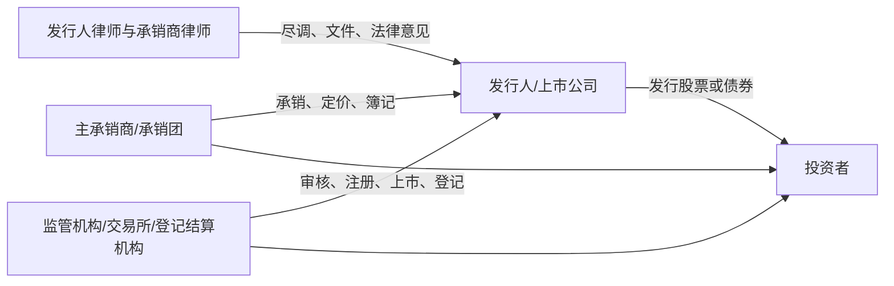
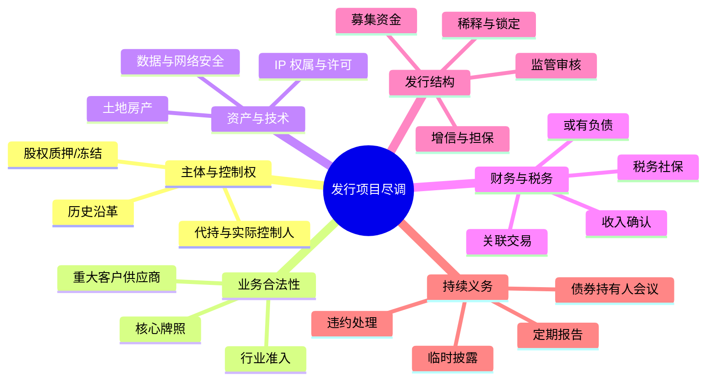

## 第八课：ECM 与 DCM 入门——股票和债券交易到底在做什么

### 1. 先用一句话区分 ECM 和 DCM

**ECM（Equity Capital Markets，股权资本市场）** 解决“公司如何用发行股份换取资本”，投资者取得股票、表决权或其他股东权益，回报主要来自分红和股价变化。

**DCM（Debt Capital Markets，债务资本市场）** 解决“公司如何借钱并承诺按期还本付息”，投资者取得债权，不当然取得股东表决权，回报主要来自利息和本金偿还。

| 比较项 | ECM | DCM |
|---|---|---|
| 融资工具 | IPO、增发、配股、可转债、GDR 等 | 公司债、企业债、中期票据、短期融资券、境外债等 |
| 投资者地位 | 股东或潜在股东 | 债权人或票据持有人 |
| 主要风险 | 经营亏损、股价波动、稀释 | 违约、交叉违约、利率和再融资风险 |
| 核心文件 | 招股说明书、上市公告书、承销协议 | 募集说明书、承销协议、债券契约、受托管理协议 |
| 核心审查 | 发行条件、持续经营、财务和业务真实性 | 偿债能力、募集资金用途、担保、契约保护 |
| 律师工作 | 尽调、招股书核查、法律意见、监管问询回复 | 尽调、法律意见、募集说明书核查、债券条款和违约机制 |

### 2. 资本市场交易的五个角色

把交易先画成一个关系图：

初学者先记住：**律师通常不替发行人保证“投资一定赚钱”，而是核查发行人是否依法披露重大事实，文件是否存在重大遗漏、虚假记载或误导性陈述。**

### 3. ECM 基本流程：从准备到上市

#### 3.1 典型流程

1. **项目启动和中介聘任**：发行人聘请保荐人/承销商、发行人律师、会计师等。
2. **尽职调查**：核查主体、股权、历史沿革、业务资质、土地房产、知识产权、重大合同、劳动、税务、环保、数据和诉讼/监管事项。
3. **重组和规范**：解决同业竞争、关联交易、历史出资瑕疵、代持、许可缺失和独立性问题。
4. **申报文件准备**：招股说明书、法律意见书、律师工作报告、审计报告、内部控制文件及问询回复。
5. **审核/注册/发行**：按适用板块和发行制度完成交易所审核、证监会注册（如适用）、询价、定价和配售。
6. **上市及持续义务**：股票上市、登记结算、定期报告、临时公告、再融资和重大事项披露。

不同市场和发行类型的具体监管机关、程序和文件会变化。学习时不要把某一历史题的“核准制、备案制、审核制”直接写成所有交易的现行规则；应先确认发行地、板块、发行人类型和交易时点。

#### 3.2 招股说明书为什么是核心文件

招股说明书的目的不是把公司宣传得最好，而是让投资者能够在充分信息基础上作出投资决定。初学者阅读时按六个问题检查：

- 公司是谁，股权和控制权是否清楚？
- 公司靠什么业务赚钱，收入和利润是否可持续？
- 关键资产、牌照、技术和客户是否真实可用？
- 有没有重大负债、担保、关联交易、环保或税务风险？
- 募集资金投向是否具体，是否与主营业务相关？
- 发行后有哪些稀释、锁定、同业竞争和持续披露问题？

**行业概览不是营销段落。** Morgan Lewis 真题要求写行业概览时，合伙人通常希望看到市场规模、竞争格局、监管环境、增长驱动、周期性和发行人所处位置，并要求把可核验来源与发行人自身经营数据区分开。

### 4. DCM 基本流程：借款人如何发行债券

债券项目可以理解为“把一笔贷款标准化并分割给很多投资者”。流程通常包括：

1. 确定发行人、担保人、发行规模、期限、利率和币种；
2. 设计募集资金用途、偿债来源和担保/增信结构；
3. 尽调发行人、集团公司、重大资产、财务和重大合同；
4. 起草募集说明书、债券条款、承销协议、受托管理协议和担保文件；
5. 完成评级、备案/注册、簿记建档、定价和交割；
6. 进行利息支付、信息披露、受托管理和违约处置。

#### 4.1 债券条款初学者清单

| 条款 | 初学者要问什么 |
|---|---|
| Principal/本金 | 到期日还多少？是否分期偿还？ |
| Interest/利息 | 固定还是浮动？支付日和利率调整机制是什么？ |
| Maturity/到期 | 能否提前赎回、回售或延期？ |
| Use of proceeds/募集资金用途 | 是否允许改变用途？改变是否构成违约？ |
| Representations/陈述 | 财务、授权、无违约和合规事实是否真实？ |
| Covenants/承诺 | 是否限制新增债务、担保、资产出售或分红？ |
| Events of Default/违约事件 | 未付款、交叉违约、破产、重大违法如何定义？ |
| Security/担保 | 是保证、抵押、质押还是无担保发行？担保何时设立？ |
| Trustee/受托管理 | 谁代表持有人监督、召集会议和执行权利？ |
| Enforcement/执行 | 违约后通知、加速到期、处置担保和分配顺序是什么？ |

### 5. ECM/DCM 都绕不开的披露责任

初学者可以把披露责任分成三层：

1. **真实性**：已披露信息与事实相符；
2. **准确性**：数字、日期、主体、合同和监管状态没有错误；
3. **完整性**：没有遗漏足以改变投资者判断的重要事实。

“没有虚假记载、误导性陈述或重大遗漏”是学习资本市场法律意见和尽调报告时的核心语言。律师需要建立 **source-to-disclosure trail**：每个关键披露都能追溯到合同、登记资料、政府文件、访谈记录或审计底稿。

### 6. 资本市场尽调的红旗思维图

### 7. 与并购业务的连接

ECM/DCM 不是独立于 M&A 的“另一门课”。常见交叉点包括：

- 并购价款用可转债、股份支付或定向发行融资；
- 收购上市公司触发要约、权益变动和控制权披露；
- 并购交割前需要解除股票质押、担保或债券契约限制；
- 发行人收购境外资产时，需要同时处理外商投资、境外投资、外汇和反垄断审查；
- 债务融资文件的 change of control、cross-default 可能直接影响并购是否可完成；
- 发行前重组中的关联交易和历史代持，会同时成为上市审核和 SPA 赔偿问题。

因此，面试中遇到“先收购再 IPO”或“以债融资收购”时，应同时画两条时间线：**交易交割线**和**融资/监管线**。

### 8. 真题映射：Morgan Lewis 行业概览与 JV 股东借款

这类题目可以拆成两个层次：

**第一层：事实核查。** 股东借款是否有董事会/股东批准、利率是否符合独立交易原则、是否存在利益冲突、资金是否实际到账、是否形成关联方占用？

**第二层：披露表达。** 在招股书或交易备忘录中，不能只写“股东贷款符合市场条件”。应说明交易背景、金额、期限、利率、担保、审批过程、关联关系和对财务报表的影响，并由可核验文件支持。

英文分析句：

> **The key issue is not merely whether the shareholder loan is permitted, but whether it was approved, priced and disclosed on an arm’s-length basis. We would test the corporate approvals, conflict management, funds flow, repayment terms, security package and accounting treatment, and then assess whether the arrangement creates an ongoing related-party disclosure or listing concern.**

### 9. ECM/DCM 英文答题模板

> **BLUF:** I would begin by identifying the instrument, the issuing entity, the target investor base and the applicable market. The legal work then has two parallel tracks: first, whether the issuer is legally able to issue the instrument; second, whether the offering documents fairly and accurately disclose the risks that would affect an investor’s decision.
>
> **ECM application:** For an equity offering, I would focus on title and control, capitalization, business qualifications, financial and tax history, related-party transactions, IP and regulatory compliance, as well as dilution, lock-up and use-of-proceeds issues. Any nominee holding, unpaid capital or licence defect should be resolved or clearly allocated before submission.
>
> **DCM application:** For a debt offering, I would additionally review repayment sources, financial covenants, security and guarantee perfection, events of default, cross-default, change-of-control consequences and trustee/holder enforcement mechanics. The transaction timetable must leave enough time for registration, filing and perfection of security.

### 10. 第八课自测卡

**题 1：** 为什么债券律师不能只看募集说明书？

**答题方向：** 债券权利依赖募集说明书之外的承销协议、债券条款、受托管理协议、保证/抵押/质押文件和登记手续；还要核查偿债来源、违约事件和担保可执行性。

**题 2：** 招股书里“行业规模很大”为什么不够？

**答题方向：** 需要来源、口径、时间范围和与发行人业务的关联；还要说明竞争、周期、监管和发行人市场地位，避免把宣传材料当作可核验披露。

**题 3：** 一笔并购贷款文件中出现 change-of-control 条款，你会怎么处理？

**答题方向：** 确认控制权变化定义、通知和同意机制、是否触发提前还款或违约、豁免是否需贷款人同意，并把该事项放入并购 CP、融资条件和交割资金计划。

**记忆口诀：**

> **ECM 换股权，DCM 换债权；招股书讲事实，债券文件讲还款；尽调找红旗，披露要可追溯。**