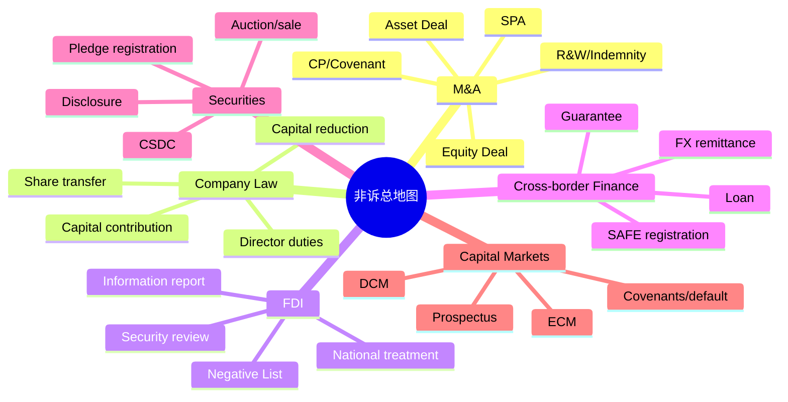

## 第十一课：非诉术语与法规记忆卡

### 1. 先背一条“总句”

> **并购先看买什么，再看谁能买；签约要管等待期，交割要过监管门；历史风险放进保证和赔偿，跨境资金分开看贷款、担保、证券和汇款；资本市场文件的核心是让投资者知道事实、风险和还款来源。**

这句话对应全书六条主线：

### 2. 六个情景化记忆场景

#### 场景一：买一栋“带历史包袱的房子”

股权收购像买下整栋房子：房屋、租约、员工、许可证和历史欠款一起进入买方视野。资产收购像只买房屋和指定设备：可以隔离部分历史负债，但要重新确认牌照、合同、员工和税务。看到题目出现“历史债务、牌照接续、员工转移、税负”时，先问：**我要买整栋房子，还是只买指定资产？**

#### 场景二：交易要经过“三道门”

把签约到交割记成三道门：

1. **合同门**：SPA 已签，但仍有 CP、covenant 和披露更新；
2. **监管门**：反垄断、外商投资、国家安全、行业许可、登记和外汇事项；
3. **交付门**：价款、股权文件、辞任函、印章账簿、登记和控制权真正交接。

面试问“能否明天交割”，先逐门检查；赔偿条款只能处理金钱风险，不能替代法定监管门。

#### 场景三：资本像“水库”，股东像“承诺进水的人”

认缴资本是股东向公司承诺注入的水量。公司法第47条规定有限责任公司认缴出资期限的基本框架；第51、52条处理催缴、核查和股东失权；第54条处理特定情形下的加速到期；第88条处理未缴出资股权转让后的责任。题目出现“未缴出资”，按 **金额—期限—是否到期—谁承担—如何补救** 五步记忆。

#### 场景四：SAFE 是“跨境资金的四本账”

看到跨境借款或担保，不要把所有事项混成“外汇问题”。分别记四本账：

- **贷款账**：本金、利息、期限、用途、外债额度；
- **担保账**：内保外贷、外保内贷、其他跨境担保及登记/报送；
- **证券账**：股票或债券质押登记、处置和受让资格；
- **汇款账**：购汇、真实性审核、税费、汇出路径。

#### 场景五：股票质押像“把钥匙交给债权人，但不能预先把房子直接送走”

先登记质押，再在违约后按适用规则折价、拍卖或变卖；《民法典》第428条的流质限制提醒我们，债务到期前不能简单约定担保物自动归债权人。第443条关注以证券出质的登记公示。最终能否由境外主体受让、能否购汇汇出，要另看证券、外汇和监管规则。

#### 场景六：资本市场是“让陌生投资者看懂风险”

ECM 是发行股票换资本，DCM 是发行债券换资金。招股说明书和募集说明书都要回答：**钱从哪里来、业务是否真实、风险是什么、发生问题谁承担、投资者如何退出或受偿。**

### 3. 非诉核心术语速查表（第一组：交易结构与 SPA）

| 中文规范术语 | 大所通用英文 | 记忆句 | 典型场景 |
|---|---|---|---|
| 股权收购 | share acquisition / share deal | 买下公司及其历史 | Equity Deal |
| 资产收购 | asset acquisition / asset deal | 只买指定资产和业务 | Asset Deal |
| 业务剥离 | carve-out | 从原集团切出一块业务 | 分拆出售 |
| 股权购买协议 | Share Purchase Agreement (SPA) | 约定股权怎么卖、钱怎么付 | M&A 主协议 |
| 签约 | signing / execution | 合同先成立 | SPA 签署 |
| 交割 | closing / completion | 钱、股权和控制权交接 | Closing |
| 过渡期 | interim period | 签约后等待交割的时间 | CP 未满足时 |
| 交割先决条件 | Conditions Precedent (CPs) | 门没开，买方通常不用交割 | 审批、解除质押 |
| 交割交付物 | closing deliverables | 交割当天要交换的文件 | 文件清单 |
| 陈述与保证 | representations and warranties | 对事实作出的合同保证 | R&W |
| 根本性保证 | fundamental warranties | 股权、授权、主体等核心保证 | 高 cap/长存续 |
| 业务性保证 | business warranties | 财税、合同、员工、IP 等经营事实 | 一般保证 |
| 披露函 | Disclosure Letter | 把例外事实逐项摆出来 | 限定 R&W |
| 承诺 | covenant / undertaking | 签约后要做或不做什么 | 经营限制 |
| 正常经营 | ordinary course of business | 按过去惯例经营 | 过渡期 |
| 重大不利影响 | Material Adverse Effect (MAE) | 变化严重到影响交易或目标 | 终止/CP |
| 专项赔偿 | Specific Indemnity | 已知红旗单独分配损失 | 欠税、代持 |
| 托管 | escrow | 先留一笔钱保障赔偿 | 赔偿保障 |
| 责任上限 | liability cap | 最多赔多少 | 责任限制 |
| 免赔额/累计门槛 | basket / de minimis | 小额损失不单独追 | 赔偿门槛 |
| 存续期 | survival period | 交割后多久还能索赔 | 索赔期限 |
| 最终截止日 | Long-stop Date / Outside Date | 最晚等到哪天 | CP 未满足 |
| 终止权 | termination right | 交易失败时谁能退出 | 终止条款 |
| 反向分手费 | reverse break fee | 买方未完成交易时的约定费用 | 监管失败/融资失败 |
| 已知违约索赔规则 | sandbagging | 买方早知道还能不能索赔 | Pro/Anti |

**记忆串**：

> **签约立约，过渡守约；CP 开门，Closing 交货；R&W 说事实，Disclosure 说例外；Indemnity 说赔钱，Escrow 留钱；MAE 管大变，Long-stop 管最后一天。**

### 4. 非诉核心术语速查表（第二组：公司法与治理）

| 中文规范术语 | 大所通用英文 | 记忆句 | 典型场景 |
|---|---|---|---|
| 注册资本 | registered capital | 章程和登记显示的资本数额 | 尽调/上市 |
| 认缴出资 | subscribed capital contribution | 股东承诺将来缴多少 | 出资期限 |
| 实缴出资 | paid-in capital contribution | 已经实际缴进去多少 | 资本核查 |
| 出资期限 | contribution period | 什么时候必须缴 | 公司法第47条 |
| 加速到期 | acceleration of contribution obligation | 还没到期，特定情形先到期 | 公司法第54条 |
| 催缴 | demand for contribution | 公司正式要求股东缴款 | 第51、52条 |
| 股东失权 | forfeiture of equity interest | 逾期不缴可能失去对应股权 | 第52条 |
| 股权转让 | equity transfer / transfer of shares | 股东换人 | 第88条 |
| 股权权利负担 | Encumbrance over equity | 质押、冻结等限制 | Title warranty |
| 实际控制人 | controlling person | 实际决定公司重大事项的人 | 控制权穿透 |
| 事实董事 | de facto director | 虽未任职却实际行使董事权力的人 | 第180条第3款 |
| 关联交易 | related-party transaction | 公司与关联方做交易 | 治理/披露 |
| 忠实义务 | duty of loyalty | 不得把公司机会和利益拿走 | 董事/高管 |
| 勤勉义务 | duty of care | 应以合理谨慎管理公司 | 董事/高管 |
| 股东代表诉讼 | shareholder derivative action | 股东代公司追责 | 公司利益受损 |
| 司法解散 | judicial dissolution | 公司僵局严重时请求法院解散 | 第182条等 |
| 同比例减资 | pro rata capital reduction | 股东按比例一起减资 | 第224条 |
| 简易减资 | simplified capital reduction | 特定条件下简化减资程序 | 第225条 |

**数字记忆**：

> **47 看期限，51/52 看催缴和失权，54 看加速，88 看转让责任，180(3) 看事实董事，192 看控制人责任，224/225 看减资。**

### 5. 非诉核心术语速查表（第三组：外资、跨境金融与证券）

| 中文规范术语 | 大所通用英文 | 记忆句 | 典型场景 |
|---|---|---|---|
| 外商投资 | foreign investment | 境外投资者直接或间接进入中国 | FIL |
| 外商投资企业 | foreign-invested enterprise (FIE) | 外资进入后的中国主体 | WFOE/JV |
| 准入前国民待遇 | pre-establishment national treatment | 准入阶段原则上与内资同等对待 | FIL 第4条 |
| 外商投资准入特别管理措施 | Negative List | 清单内限制或禁止，清单外按国民待遇 | FDI |
| 外商投资信息报告 | foreign investment information reporting | 向商务/市场监管体系报送外资信息 | FDI |
| 国家安全审查 | national security review (NSR) | 关键行业和控制权交易的安全门 | NSR |
| 关联并购 | related-party merger and acquisition | 境外关联方买境内企业的特殊审查点 | 10号文第11条 |
| 外债 | foreign debt / cross-border borrowing | 境内主体向境外借的债 | SAFE/NDRC |
| 全口径跨境融资 | macro-prudential cross-border financing | 额度取决于净资产等参数 | 银发〔2017〕9号 |
| 内保外贷 | domestic guarantee for offshore loan | 境内担保、境外借款 | SAFE |
| 外保内贷 | offshore guarantee for domestic loan | 境外担保、境内借款 | SAFE |
| 跨境担保登记/报送 | cross-border guarantee registration/reporting | 担保本身另有外汇手续 | SAFE |
| 购汇 | foreign exchange purchase | 用人民币换外币 | 汇出前 |
| 汇出 | remittance abroad | 把资金合法付到境外 | 银行审核 |
| 股票质押 | pledge of shares | 用股票担保债务 | 民法典第443条 |
| 质权设立/公示 | perfection/publicity of pledge | 登记让质押对外可见 | CSDC |
| 流质契约 | forfeiture arrangement | 到期前不能简单约定股权自动归债权人 | 民法典第428条 |
| 折价、拍卖、变卖 | appropriation, auction or sale | 违约后实现担保的路径 | 民法典第437、438条 |
| 中国结算 | China Securities Depository and Clearing Corporation Limited (CSDC) | A 股登记结算基础机构 | 质押/过户 |

**四账记忆**：

> **借款看额度，担保看登记，股票看质押，汇款看购汇；四本账分开，结论才不乱。**

### 6. 非诉核心术语速查表（第四组：资本市场与起草）

| 中文规范术语 | 大所通用英文 | 记忆句 | 典型场景 |
|---|---|---|---|
| 股权资本市场 | Equity Capital Markets (ECM) | 发行股份换资本 | IPO/增发 |
| 债务资本市场 | Debt Capital Markets (DCM) | 发行债券换资金 | 公司债/境外债 |
| 发行人 | issuer | 谁发股票或债券 | ECM/DCM |
| 承销商 | underwriter | 帮发行、定价和配售 | 发行项目 |
| 主承销商 | lead underwriter / lead manager | 牵头组织发行 | 资本市场 |
| 招股说明书 | prospectus | 股票投资者看到的核心文件 | IPO |
| 募集说明书 | offering circular / offering memorandum | 债券投资者看到的核心文件 | DCM |
| 法律意见书 | legal opinion | 律师对关键法律问题的正式结论 | 发行/融资 |
| 尽职调查 | due diligence | 先查事实再写文件 | 全流程 |
| 信息披露 | disclosure | 把影响投资决定的事实说清 | 资本市场 |
| 募集资金用途 | use of proceeds | 融到的钱准备怎么用 | ECM/DCM |
| 受托管理人 | trustee / bond trustee | 代表债券持有人监督和行动 | DCM |
| 违约事件 | Event of Default | 什么情况触发债权人救济 | 债券条款 |
| 交叉违约 | cross-default | 另一笔债务违约也影响本债务 | 融资文件 |
| 控制权变更 | change of control | 控制权变化可能触发同意/提前还款 | 并购融资 |
| 重大合同 | material contract | 对业务或财务有重大影响的合同 | 尽调 |
| 关联方 | related party | 与公司有控制或重大影响关系的人 | 披露/治理 |
| 独立交易原则 | arm’s-length principle | 关联交易按独立第三方条件做 | JV/上市 |

### 7. 法规记忆卡：一张卡只记一个动作

| 法规/文号 | 初学者先记什么 | 交易动作 |
|---|---|---|
| 《公司法》第47条 | 认缴出资期限的基本框架 | 查章程、成立日期和过渡规则 |
| 《公司法》第51、52条 | 催缴、核查、失权 | 查催缴通知、程序和股权处理 |
| 《公司法》第54条 | 特定情形下加速到期 | 查到期债务和清偿能力事实 |
| 《公司法》第88条 | 未缴出资股权转让责任 | 在 SPA 分配转让人/受让人风险 |
| 《公司法》第180条第3款 | 事实董事责任 | 穿透实际行使董事职能者 |
| 《公司法》第182、192条 | 解散、控制人责任的风险 | JV 僵局和控制权穿透分析 |
| 《公司法》第224、225条 | 普通/简易减资 | 设计补缴、减资和债权人保护方案 |
| 《外商投资法》第4、28条 | 国民待遇和负面清单 | 先查行业是否在清单内 |
| 《外商投资法》第34、35条 | 信息报告和国家安全审查 | 设定报告/审查 CP |
| 国家发改委、商务部令第37号 | NSR 的行业、控制和实际影响 | 穿透股权、治理和资金安排 |
| 10号文第11条 | 关联并购特殊审查 | 查关联关系、交易真实性和审批 |
| 10号文第16条 | 出资时限历史考点 | 按交易时点核对现行适用性 |
| 汇发〔2014〕29号 | 跨境担保三分类 | 先分类，再查登记/报送 |
| 汇发〔2013〕19号 | 外债和跨境担保外汇管理基础 | 查登记、履约和资金路径 |
| 银发〔2017〕9号 | 全口径跨境融资宏观审慎额度 | 查净资产、杠杆和额度 |
| 汇发〔2016〕16号 | 资本项目外汇收入支付便利化框架 | 查资金用途和真实性 |
| NDRC令第56号 | 中长期外债审核登记 | 查期限、主体和募集资金用途 |
| 《民法典》第428条 | 流质限制 | 不把自动取得担保物写成当然有效 |
| 《民法典》第437、438条 | 折价、拍卖、变卖和价款分配 | 设计违约处置和清偿顺序 |
| 《民法典》第443条 | 证券质押登记公示 | 核查 CSDC 登记和质权设立 |

**法规背诵法**：每张卡只回答三个问题：

1. **它管什么？**（资本、外资、担保、证券还是披露）
2. **它在交易哪一步出现？**（尽调、签约、CP、交割、违约还是上市后）
3. **律师要拿什么证据？**（章程、登记簿、审批文件、银行回单、监管通知或合同）

### 8. 主动回忆卡（不要先看答案）

**卡 1：** Equity Deal 和 Asset Deal 最快的区别是什么？

**答案：** Equity Deal 买公司及其历史；Asset Deal 买指定资产和业务，通常需要单独处理资产转移、牌照、员工和合同承接。

**卡 2：** CP 和 covenant 的一句话区别？

**答案：** CP 是交割前必须发生的门槛；covenant 是签约后当事人必须做或不得做的行为。

**卡 3：** 未缴出资五步法？

**答案：** 金额、期限、是否到期、责任人、补救方案。

**卡 4：** 跨境担保题为什么要分账？

**答案：** 贷款、担保、证券和购汇汇出分别受不同规则和办理环节控制，不能用一个“外汇批准”概括。

**卡 5：** MAE 的三要素？

**答案：** 影响对象、严重程度、持续性/可预期性，再加 carve-outs 和不成比例影响回拨。

**卡 6：** 资本市场披露的三层要求？

**答案：** 真实、准确、完整。

**卡 7：** 50:50 JV 僵局的第一反应？

**答案：** 先看章程、合资合同和僵局机制，再处理关联交易证据和救济，最后才评估解散或另设 WFOE。

**卡 8：** 代持风险为什么不能只用 indemnity 解决？

**答案：** 赔偿只能提供金钱救济，不能自动完成股权登记、解除质押或消除第三方权利。

### 9. 一页式复习路线

#### 第 1 轮：建立地图（第 1–3 天）

- 只读每课标题、总句、思维导图和记忆口诀；
- 能口头解释 Equity/Asset、CP/R&W/Covenant、ECM/DCM；
- 不要求背条文，先能说出每个问题属于哪条主线。

#### 第 2 轮：抓住法规动作（第 4–7 天）

- 每天复习 5 张法规卡；
- 用“法规—动作—证据”三格法回答；
- 练习把一个风险放入 CP、covenant、R&W、Specific Indemnity 或 Escrow。

#### 第 3 轮：连接真题（第 8–14 天）

- 每天完成一题真题型事实；
- 用 5 分钟中文列事实地图，10 分钟英文写 BLUF；
- 对照第十课五个情境，检查是否写出监管时点和替代方案。

#### 第 4 轮：限时输出（第 15–21 天）

- 每两天做一次 30 分钟小模拟；
- 先写一段 80–120 字 BLUF，再写三段 IRAC；
- 最后用红旗清单检查：日期、责任人、证据、CP、终止机制。

#### 第 5 轮：间隔复习（第 22–30 天及以后）

- 第 1 天学完后，第 3、7、14、30 天各复习一次；
- 每次先闭卷回忆，再打开手册核对；
- 把答错的卡片单独放入“二次复习堆”，直到连续两次答对。

### 10. 全书索引（按学习问题查找）

| 你想解决的问题 | 先读章节 | 记忆关键词 |
|---|---|---|
| 买股权还是买资产 | 第一课 | 历史负债、牌照、员工、税 |
| 未缴出资怎么办 | 第二课、第七课 | 47/51/52/54/88、专项赔偿 |
| 外资能不能进入行业 | 第三课 | 国民待遇、负面清单、信息报告 |
| 会不会触发 NSR | 第三课、第十课 Case 5 | 行业、控制、实际影响 |
| 跨境借款怎么合规 | 第四课 | 外债、担保、额度、用途 |
| 股票质押如何执行 | 第五课、第十课 Case 3 | 443、CSDC、流质、拍卖、购汇 |
| SPA 如何安排风险 | 第六课、第七课 | CP、R&W、Disclosure、Indemnity |
| 如何处理 MAE 和已知违约 | 第七课 | carve-out、sandbagging、escrow |
| ECM/DCM 如何区分 | 第八课 | 股权、债权、招股书、偿债 |
| 两小时英文笔试怎么写 | 第九课 | BLUF、IRAC、redline、时间表 |
| 专业面试怎么回答 | 第十课 | Answer–Rule–Apply–Allocate |
| 术语和条文怎么背 | 第十一课 | 总句、情景、法规卡、主动回忆 |

### 11. 最终考试前的 10 分钟清单

1. 我能否用一句话说清交易结构？
2. 我是否确认了交易时点和适用规则版本？
3. 是否存在必须在交割前解决的监管或登记事项？
4. 谁负责申请、付款、配合和承担失败后果？
5. 风险属于 CP、covenant、R&W、专项赔偿还是价格调整？
6. 卖方赔偿是否有 cap、basket、期限和托管？
7. 是否存在代持、质押、关联交易、未缴出资或控制权问题？
8. 跨境资金是否分别检查贷款、担保、证券和汇款？
9. 英文答案是否先给 BLUF，再给规则和交易建议？
10. 是否明确写出需要向主管机关、经办银行或登记机构核验的事项？

**最终记忆句：**

> **先定结构，再查准入；先画时间，再设 CP；事实写保证，红旗写赔偿；资金分四账，证券看登记；答案先结论，复习靠回忆。**